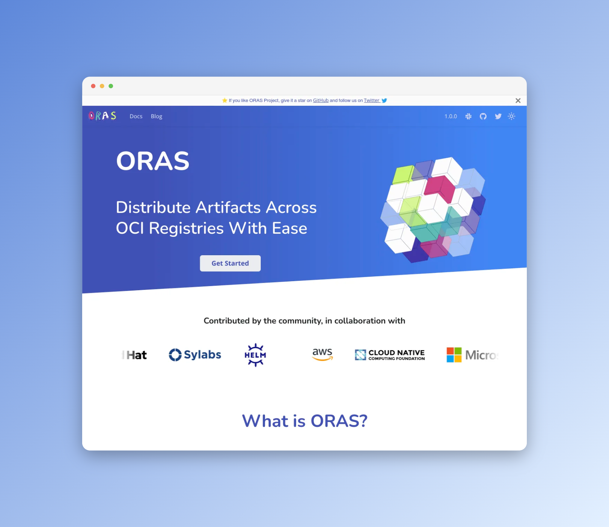

[](https://app.netlify.com/sites/oras-project/deploys)

# ORAS Documentation

Source for ORAS website and documentation

<p align="left">
<a href="https://oras.land/"></a>
</p>

[](https://opensource.org/licenses/Apache-2.0)

[This website](https://oras.land/) is built using [Docusaurus 2](https://v2.docusaurus.io/). Pages and components are built in JavaScript, and styles are written in vanilla CSS.

<div align="center">
  <a href="https://oras.land/">
    
  </a>
</div>
<div align="center">
  <a href="https://oras.land/">
    oras.land
  </a>
</div>

# Development

## Online one-click setup

You can use Gitpod (a free, online, VS Code-like IDE) for contributing. With a single click, it will launch a workspace (for Docusaurus 2) automatically:

-   clone the docusaurus repo.
-   install the dependencies.
-   run `npm start`

So that you can start contributing straight away.

[](https://gitpod.io/#https://github.com/oras-project/oras-www)

## System Requirements

-   [Node.js v18.x](https://nodejs.org/en/download/) and above

## Installation

```script
npm install
```

## Local development

```script
npm run start
```

This command starts a local development server and open up a browser window.
Most changes are reflected live without having to restart the server.
The site will be available at http://localhost:3000/

## Build for production

```script
npm run build
```

This command generates static content into the `build` directory and can be
served using any static contents hosting service. For that purpose, you can also
use:

```script
npm run serve
```

## Code of Conduct

This project has adopted the [CNCF Code of Conduct](https://github.com/cncf/foundation/blob/master/code-of-conduct.md). See [CODE_OF_CONDUCT.md](CODE_OF_CONDUCT.md) for further details.

## Contributions

Thank you for considering to contribute to the project, We appreciate your time and effort. Checkout the [Contribution Guide](https://oras.land/docs/community/contributing_guide) to know more about contributing.
