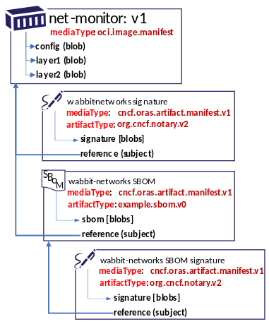

Today, the [OCI Registry As Storage (ORAS)](https://oras.land/) project maintainers are happy to announce the first draft release of [artifacts-spec](https://github.com/oras-project/artifacts-spec/releases/tag/1.0.0-draft.1). The artifacts-spec defines how OCI distribution-based registry users can attach references to images, helm charts, and other [OCI Artifacts](https://github.com/opencontainers/artifacts).

<!--truncate-->

As cloud native development continues to grow, we have seen increased community interest in evolving registries to natively store, discover, and pull a graph of supply chain artifacts. Artifact references are important for many use cases such as adding Software Bill of Materials (SBoM), security scan results, and container image signing. With the release of the artifacts specification, end-user tooling can now implement discovery that makes it feasible to determine if there are any references attached to a container image, answering the key question: “What SBOMs or signatures are associated with this container image?” 

 
The ORAS Project was accepted in June 2021 as a Cloud Native Computing Foundation (CNCF) Sandbox project. It is important that we hear from the community as we advance the artifact-spec capability; if you maintain or are implementing a container registry, we are particularly [interested in your feedback](https://github.com/oras-project/artifacts-spec#community). Working together, we can improve supply chain artifact security in the cloud native ecosystem. 
