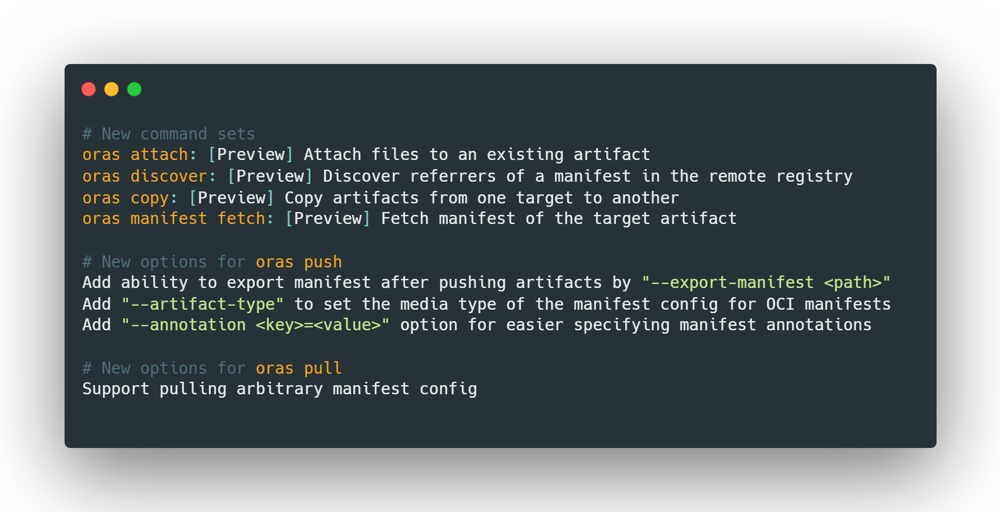
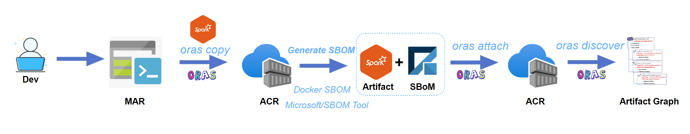

The [OCI Registry As Storage (ORAS)](https://oras.land/) project maintainers announced v0.14 release for the ORAS CLI recently. ORAS v0.14 introduces four new top-level commands and new options to manage supply chain artifacts across different container registries and multi-cloud environments. 

<!--truncate-->

## What's new in ORAS 0.14



Please see the [Release Notes](https://github.com/oras-project/oras/releases/tag/v0.14.0) for details.

Prior to ORAS CLI v0.14 release, the ORAS Go library, also released v2.0.0-rc.2 to support [artifacts-spec v1.0.0-rc.2](https://github.com/oras-project/artifacts-spec/releases/tag/v1.0.0-rc.2) and provides new functions to enable developers to build your own OCI client tool.

As cloud native development continues to grow, we have seen increased community interest in evolving registries to natively store, pull, copy, and discover a graph of supply chain artifacts. Artifact references are important for many use cases such as adding Software Bill of Materials (SBoM), security scan results, and container image signatures. 

This blog will demonstrate how to use ORAS CLI v0.14 to copy an image from a public registry validated by Microsoft to a private registry, then attach an SBoM to it and discover the reference in a tree graph.



> Note: we will use MAR (Microsoft Artifact Registry) and ACR (Azure Container Registry) for demonstration purpose only. There will be another [blog posts](https://github.com/oras-project/oras-www/issues/54) to demonstrate how to use ORAS with Amazon ECR and Google GAR soon. 

## Install ORAS 0.14

Install the latest release of ORAS on a Linux environment:

```
curl -LO https://github.com/oras-project/oras/releases/download/v0.14.1/oras_0.14.1_linux_amd64.tar.gz
mkdir -p oras-install/
tar -zxf oras_0.14.1_*.tar.gz -C oras-install/
mv oras-install/oras /usr/local/bin/
rm -rf oras_0.14.1_*.tar.gz oras-install/
```

> Note: You can also refer to the [installation guide](https://oras.land/cli/) for other different platforms.

## Copy an image from Registry A to Registry B

In this demo, we'll use ORAS to copy the container image from the public MAR registry to my private ACR registry. You can use your preferred container registry with ORAS.

```
oras copy mcr.microsoft.com/mmlspark/spark2.4:1.0.0 feynmanacr.azurecr.io/mmlspark/spark2.4:1.0.0
```

## Using SBOM Tool to generate a SBOM

An SBOM creates a machine-readable inventory of the software components that make up a given software product. Generating SBOM is a first step in Supply Chain Security. 

You can use [Docker SBOM](https://docs.docker.com/engine/sbom/) or [SBOM Tool](https://github.com/microsoft/sbom-tool) to generate a SBOM for the target image.

SBOM Tool can be used to create SPDX 2.2 compatible SBOMs for any variety of artifacts. In this demo, we use SBOM Tool to create SPDX 2.2 compatible SBOM for the sample Spark image.

Install the SBOM Tool within a Linux environment:

```
curl -Lo sbom-tool https://github.com/microsoft/sbom-tool/releases/latest/download/sbom-tool-linux-x64
chmod +x sbom-tool
```

Generate a SBOM for the Spark image stored in ACR:

```
sbom-tool generate -di feynmanacr.azurecr.io/mmlspark/spark2.4:1.0.0 \
  -b ./foo \
  -pn bar \
  -pv 0.1 \
  -bc ./foo \
  -ps MyCompany \
  -nsb http://mycompany.com
```

Then it will create a SBOM `manifest.spdx.json` in `foo/_manifest/spdx_2.2`.

## Attach the SBOM to this image

Next, let's attach the generate SBOM to this Spark image stored in ACR:

```
$ oras attach feynmanacr.azurecr.io/mmlspark/spark2.4:1.0.0 foo/_manifest/spdx_2.2/manifest.spdx.json --artifact-type example/sbom
Uploading 97a5dc071dd1 manifest.spdx.json
Uploaded  97a5dc071dd1 manifest.spdx.json
Attached to feynmanacr.azurecr.io/mmlspark/spark2.4:1.0.0
Digest: sha256:7592c8026675e463e7ced9b7ed369c2962b354a69b842423e8ctestdigest
```

## View the graph of artifacts

A linked graph of supply chain artifacts can be viewed through the ORAS discovery command:

```
$ oras discover feynmanacr.azurecr.io/mmlspark/spark2.4:1.0.0
Discovered 1 artifacts referencing feynmanacr.azurecr.io/mmlspark/spark2.4:1.0.0
Digest: sha256:28de427f1df8cdb99bc98536b489d75cc496a2d37c3b9266248etestdigest

Artifact Type   Digest
example/sbom    sha256:7592c8026675e463e7ced9b7ed369c2962b354a69b842423e8ctestdigest
```

## ORAS Present and Future

ORAS has been integrated and adopted by some industry-leading ISVs and projects, such as [soci-snapshotter](https://github.com/awslabs/soci-snapshotter) by AWS, [KubeApps](https://github.com/vmware-tanzu/kubeapps) by VMware Tanzu, [UOR Framework](https://universalreference.io/) by Red Hat etc. 

ORAS 0.15 and future milestones will provide more capabilities to easily manage OCI content and interact with registries. It will empower the container secure supply chain and focus on the following areas:

- Be able to manage repository, tag, manifest, and blob
- Support and migrate to OCI reference types
- Support push/pull artifacts from OCI Image Layout
- E2E testing

See the ORAS [Roadmap](https://github.com/oras-project/community/blob/main/Roadmap.md) for more details.

## Join the ORAS community
 
The ORAS Project was accepted in June 2021 as a Cloud Native Computing Foundation (CNCF) Sandbox project. It is important that we hear from the community as we advance the artifact-spec capability; if you maintain or are implementing a container registry, we are particularly interested in your feedback. Working together, we can improve supply chain artifact security in the cloud native ecosystem. 

- [Follow ORAS on X](https://x.com/intent/follow?screen_name=orasproject)

- [Join the Slack channel in CNCF](https://slack.cncf.io/) and find us at **oras** channel
