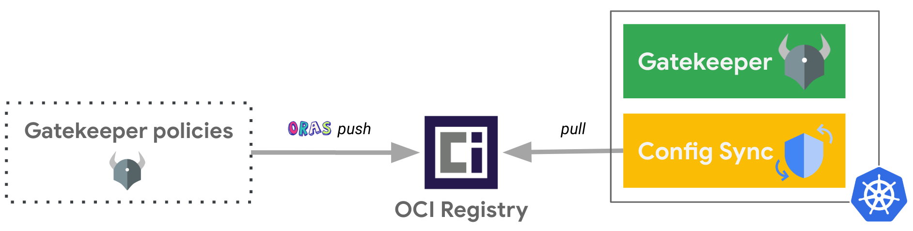

[ORAS (OCI Registry As Storage)](https://oras.land/) is an important tool out there for working with OCI artifacts and OCI registries. As one of the users and advocates of ORAS, I witnessed the [growing trend in both user adoption and contributions in 2022](https://oras.land/blog/oras-looking-back-at-2022-and-forward-to-2023/). In this blog post I will share an end-to-end scenario with OPA Gatekeeper policies and ORAS, from including the steps from bundling to deployment.

Policies are rules expressed in YAML that not only afford meeting governance requirements, but also improve the security of Kubernetes workloads and clusters. Policy engines like [OPA Gatekeeper](https://open-policy-agent.github.io/gatekeeper/website/docs/), [Kyverno](https://kyverno.io/) or even the new Kubernetes's [Validating Admission Policies](https://kubernetes.io/blog/2022/12/20/validating-admission-policies-alpha/) feature help write and enforce such policies. Once the policies are written, however, how do we easily and securely share them with different projects and teams? How do we deploy them across the fleet of clusters? How do we evaluate them as early as possible in CI/CD pipelines?

<!--truncate-->

In this blog post we will demonstrate how to bundle and share Gatekeeper policies as an OCI image using the [ORAS](https://oras.land/cli/) command line client, how to evaluate any Kubernetes manifests against this OCI image with the [`gator`](https://open-policy-agent.github.io/gatekeeper/website/docs/gator/) command line client, and how to deploy this OCI image in Kubernetes clusters, in a GitOps way.



_While we use [Google Artifact Registry](https://cloud.google.com/artifact-registry) as the OCI registry for this example, you can use [any registry supporting OCI artifacts](https://oras.land/implementors/#registries-supporting-oci-artifacts). For the GitOps tool, we are using the OSS project: [Config Sync](https://github.com/GoogleContainerTools/kpt-config-sync), and you can also use it as part of the [Anthos Config Management](https://cloud.google.com/anthos/config-management) service or even use other GitOps tools supporting OCI images like [FluxCD](https://fluxcd.io/flux/cheatsheets/oci-artifacts/)._

## Create a Gatekeeper policy

Let's create a [Gatekeeper policy](https://open-policy-agent.github.io/gatekeeper/website/docs/howto) composed by one `Constraint` and one `ConstraintTemplate` that will be leveraged throughout this blog post.

In this example, we are making sure that any non-system namespaces is leveraging the [Pod Security Admission](https://kubernetes.io/docs/concepts/security/pod-security-admission/) feature to enforce the [Pod Security Standards](https://kubernetes.io/docs/concepts/security/pod-security-standards/).

Create a dedicated folder for the associated files:
```bash
mkdir -p policies
```

Define the `ConstraintTemplate` to ensure that the Kubernetes resources contain specified labels:
```bash
cat <<EOF> policies/k8srequiredlabels.yaml
apiVersion: templates.gatekeeper.sh/v1
kind: ConstraintTemplate
metadata:
  name: k8srequiredlabels
spec:
  crd:
    spec:
      names:
        kind: K8sRequiredLabels
      validation:
        openAPIV3Schema:
          type: object
          properties:
            labels:
              description: A list of labels and values the object must specify.
              items:
                properties:
                  allowedRegex:
                    description: If specified, a regular expression the annotation's
                      value must match. The value must contain at least one match
                      for the regular expression.
                    type: string
                  key:
                    description: The required label.
                    type: string
                type: object
              type: array
  targets:
    - target: admission.k8s.gatekeeper.sh
      rego: |
        package k8srequiredlabels
        violation[{"msg": msg, "details": {"missing_labels": missing}}] {
           provided := {label | input.review.object.metadata.labels[label]}
           required := {label | label := input.parameters.labels[_].key}
           missing := required - provided
           count(missing) > 0
           msg := sprintf("You must provide labels: %v for the %s: %s.", [missing, input.review.object.kind, input.review.object.metadata.name])
        }
        violation[{"msg": msg}] {
           value := input.review.object.metadata.labels[key]
           expected := input.parameters.labels[_]
           expected.key == key
           expected.allowedRegex != ""
           not re_match(expected.allowedRegex, value)
           msg := sprintf("Label %s: %s does not satisfy allowed regex: %s", [key, value, expected.allowedRegex])
        }
EOF
```

Define the associated `Constraint` for the `Namespaces` which must have the label `pod-security.kubernetes.io/enforce` as the key and either `baseline` or `restricted` as the value:
```bash
cat <<EOF> policies/ns-must-have-pss-label.yaml
apiVersion: constraints.gatekeeper.sh/v1beta1
kind: K8sRequiredLabels
metadata:
  name: ns-must-have-pss-label
spec:
  enforcementAction: deny
  match:
    kinds:
      - apiGroups:
        - ""
        kinds:
        - "Namespace"
    excludedNamespaces:
    - config-management-monitoring
    - config-management-system
    - gatekeeper-system
    - kube-node-lease
    - kube-public
    - kube-system
    - resource-group-system
  parameters:
    labels:
    - key: pod-security.kubernetes.io/enforce
      allowedRegex: (baseline|restricted)
EOF
```

## Test this policy with local files

Define a `Namespace` without the required label.
```bash
cat <<EOF > namespace-test.yaml
apiVersion: v1
kind: Namespace
metadata:
  name: test
EOF
```

Let’s now locally test this `Namespace` against this policy with the `gator` CLI. This client makes it very convenient to test policies without any Kubernetes cluster!
```bash
gator test \
   --filename namespace-test.yaml \
   --filename policies/
```

Output similar to:
```plaintext
["ns-must-have-pss-label"] Message: "You must provide labels: {\"pod-security.kubernetes.io/enforce\"} for the Namespace: test."
```

## Push the Gatekeeper policy as OCI image to Artifact Registry

Assuming we already have a [Google Artifact Registry repository](https://cloud.google.com/artifact-registry/docs/repositories/create-repos) `ARTIFACT_REGISTRY_REPO_NAME` in the region `REGION` and project `PROJECT_ID`.

Login to Artifact Registry:
```bash
gcloud auth configure-docker ${REGION}-docker.pkg.dev
```

Push the Gatekeeper policy as OCI image in Google Artifact Registry repository with ORAS:
```bash
oras push \
    ${REGION}-docker.pkg.dev/${PROJECT_ID}/${ARTIFACT_REGISTRY_REPO_NAME}/my-policies:1.0.0 \
    policies/
```
_Note: `oras push` with the `policies/` folder will do an archive of its files._

See that the OCI image has been uploaded in the Google Artifact Registry repository:
```bash
gcloud artifacts docker images list ${REGION}-docker.pkg.dev/${PROJECT_ID}/${ARTIFACT_REGISTRY_REPO_NAME}
```

## Test this policy with the remote OCI image

Let’s now locally test the `Namespace` created earlier against this policy as remote OCI image with the gator CLI. It is very convenient to share and evaluate your policies in different places (i.e. locally, during Continuous Integration pipelines, etc.)!
```bash
gator test \
   --filename namespace-test.yaml \
   --image ${REGION}-docker.pkg.dev/${PROJECT_ID}/${ARTIFACT_REGISTRY_REPO_NAME}/my-policies:1.0.0
```
_Note: since [`gator` version 3.11.0](https://github.com/open-policy-agent/gatekeeper/releases/tag/v3.11.0), the `--image` parameter has been added! We are leveraging this feature instead of pointing to the local files like we did previously with `--filename policies/`_

Output similar to:
```plaintext
["ns-must-have-pss-label"] Message: "You must provide labels: {\"pod-security.kubernetes.io/enforce\"} for the Namespace: test."
```

## Deploy this OCI image with Config Sync

Assuming we already have a Kubernetes cluster where both [Config Sync](https://github.com/GoogleContainerTools/kpt-config-sync/blob/main/docs/installation.md) and [Gatekeeper](https://open-policy-agent.github.io/gatekeeper/website/docs/install) should be installed.

```bash
cat << EOF | kubectl apply -f -
apiVersion: configsync.gke.io/v1beta1
kind: RootSync
metadata:
  name: root-sync-policies
  namespace: config-management-system
spec:
  sourceFormat: unstructured
  sourceType: oci
  oci:
    image: ${REGION}-docker.pkg.dev/${PROJECT_ID}/${ARTIFACT_REGISTRY_REPO_NAME}/my-policies:1.0.0
    dir: .
    auth: none
EOF
```
_Note: here we are assuming that the OCI image is publicly exposed (`auth: none`) to simplify the flow of this blog post. A more secure setup can be found [here](https://medium.com/google-cloud/deploying-gatekeeper-policies-as-oci-artifacts-the-gitops-way-e1233429ae2) showing how to privately access the Google Artifact Registry repository via Workload Identity._

Verify that the `Constraint` and `ConstraintTemplate` are actually deployed:
```bash
kubectl get constraints
kubectl get constrainttemplates
```

And voilà! That’s how easy it is to deploy Gatekeeper policies as OCI image in a GitOps way. Congrats!

## Test this policy in the cluster

Let’s now try to deploy the `Namespace` defined earlier:
```bash
kubectl apply -f namespace-test.yaml
```

Output similar to:
```plaintext
Error from server (Forbidden): error when creating "namespace-test.yaml": admission webhook "validation.gatekeeper.sh" denied the request: [ns-must-have-pss-label] You must provide labels: {"pod-security.kubernetes.io/enforce"} for the Namespace: test.
```

## That's a wrap!

In this article, we were able to package Gatekeeper policies as an OCI image and push it to an OCI Registry, thanks to ORAS. Then, we were able to leverage the new OCI image parameter of `gator test` command in order to shift-left the evaluation of these policies against any Kubernetes resources outside of an actual cluster. Finally, we deployed the Gatekeeper policies as OCI image in a GitOps way.

The continuous reconciliation of GitOps reconciles between the desired state, now stored in an OCI registry, with the actual state, running in Kubernetes. Gatekeeper policies as OCI images are now just seen like any container images for your Kubernetes clusters as they are pulled from OCI registries. This continuous reconciliation from OCI registries, not interacting with Git, has a lot of benefits in terms of scalability, performance and security as you will be able to configure very fine grained access to your OCI images, across the fleet of your clusters.

_For a more complete tutorial illustrating this flow with Config Sync and Policy Controller as part of the Anthos Config Management service with Google Kubernetes Engine (GKE), you could [check this other blog post out](https://medium.com/google-cloud/deploying-gatekeeper-policies-as-oci-artifacts-the-gitops-way-e1233429ae2)._
