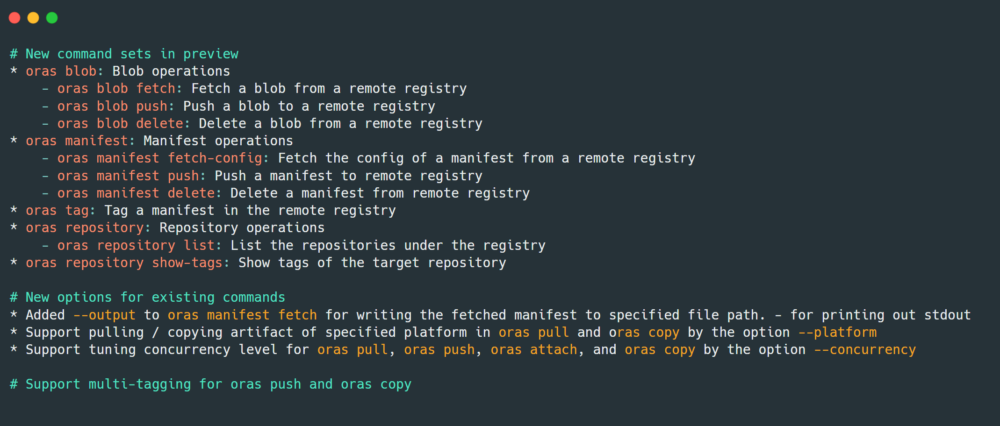
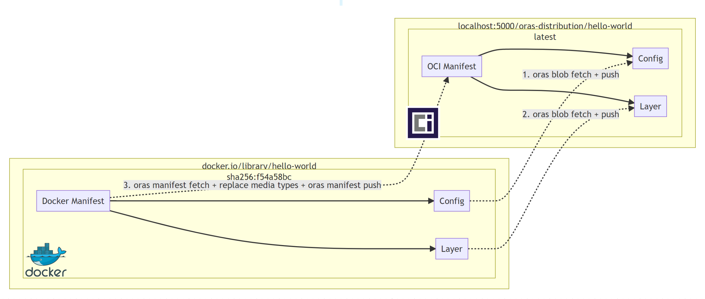

The [OCI Registry As Storage (ORAS)](https://oras.land/) project maintainers announced two releases of v0.15 for the ORAS CLI recently. ORAS [v0.15.0](https://github.com/oras-project/oras/releases/tag/v0.15.0) introduces four new top-level commands and new options to manage tags and repositories for advanced use cases. Three weeks later, [ORAS 0.15.1](https://github.com/oras-project/oras/releases/tag/v0.15.1) also released with a few known bug fixes. Since the release of v0.15, ORAS CLI has evolved into a fully functional OCI registry client.

<!--truncate-->

## What's new in ORAS 0.15



As ORAS has been adopted by more and more OCI implementors and registry vendors, we have seen increased community requirements in providing fine-grained capabilities to alter the content of OCI supply chain artifacts. ORAS 0.15 now supports granular blob and manifest operations for artifacts within the registry. Please see the [Release Notes](https://github.com/oras-project/oras/releases/tag/v0.15.0) for details.

This blog post will demonstrate how to use ORAS CLI v0.15 to convert a Docker image stored in Docker Hub into an OCI image，then push it to the Distribution registry.



## Prerequisites 

- Install [ORAS 0.15.1](https://github.com/oras-project/oras/releases/tag/v0.15.1)
- Install [Docker](https://www.docker.com/)

## Run a Distribution registry locally

Run a local instance of the CNCF Distribution Registry, with ORAS Artifacts support (Note: OCI Artifact support is coming soon):

```bash
docker run -d -p 5000:5000 ghcr.io/oras-project/registry:v1.0.0-rc.4
```

## Fetch and view the manifest of a sample Docker image

Set the environment variable as below.

```bash
docker_digest="sha256:f54a58bc1aac5ea1a25d796ae155dc228b3f0e11d046ae276b39c4bf2f13d8c4"
```

Fetch the manifest and export it to a JSON file.

```bash
oras manifest fetch docker.io/library/hello-world@$docker_digest > docker.manifest.json
```

View the generated manifest file.

```bash
cat docker.manifest.json
{
  "schemaVersion": 2,
  "mediaType": "application/vnd.docker.distribution.manifest.v2+json",
  "config": {
    "mediaType": "application/vnd.docker.container.image.v1+json",
    "size": 1469,
    "digest": "sha256:feb5d9fea6a5e9606aa995e879d862b825965ba48de054caab5ef356dc6b3412"
  },
  "layers": [
    {
      "mediaType": "application/vnd.docker.image.rootfs.diff.tar.gzip",
      "size": 2479,
      "digest": "sha256:2db29710123e3e53a794f2694094b9b4338aa9ee5c40b930cb8063a1be392c54"
    }
  ]
}
```

## Fetch and push a blob

Per [distribution-spec](https://github.com/opencontainers/distribution-spec/blob/main/spec.md#push) ,the blobs making up the object are uploaded first, and the manifest last. So we should fetch a blob from Docker Hub and push it to local registry, then upload the manifest.

Set the environment variable as below.


```
config_digest=$(cat docker.manifest.json | jq -r .config.digest)
```

Fetch a config blob to a local file from a sample Docker image:

```bash
oras blob fetch docker.io/library/hello-world@$config_digest --output config-blob.json
```

Then push this blob file to a new repository in a CNCF Distribution registry:

```bash
oras blob push localhost:5000/oras-distribution/hello-world config-blob.json
```

Similarly, fetch the layer blob and push it to the Distribution registry:

```bash
layer_digest=$(cat docker.manifest.json | jq -r .layers[].digest)
```

```bash
oras blob fetch docker.io/library/hello-world@$layer_digest --output layer-blob.json
```

```bash
oras blob push localhost:5000/oras-distribution/hello-world layer-blob.json
```

Push it to the sample repository with the blob file.

```bash
oras blob push localhost:5000/oras-distribution/hello-world layer-blob.json
```

## Fetch and push a manifest

Similar to blob operations above, fetch a manifest from a Docker image stored in Docker Hub and export it to a JSON file:

```bash
oras manifest fetch docker.io/library/hello-world@sha256:f54a58bc1aac5ea1a25d796ae155dc228b3f0e11d046ae276b39c4bf2f13d8c4 --output hello-manifest.json
```

Modify the manifest file `hello-manifest.json` from Docker to OCI type in each `mediatype` field of config and layer:

```json
{
   "schemaVersion": 2,
   "mediaType": "application/vnd.oci.image.manifest.v1+json",
   "config": {
      "mediaType": "application/vnd.oci.image.config.v1+json",
      "size": 1469,
      "digest": "sha256:feb5d9fea6a5e9606aa995e879d862b825965ba48de054caab5ef356dc6b3412"
   },
   "layers": [
      {
         "mediaType": "application/vnd.oci.image.layer.v1.tar+gzip",
         "size": 2479,
         "digest": "sha256:2db29710123e3e53a794f2694094b9b4338aa9ee5c40b930cb8063a1be392c54"
      }
   ]
}
```

Push the modified manifest file to the repository in the Distribution registry. It will also create a new repository automatically:

```
oras manifest push localhost:5000/oras-distribution/hello-world:latest hello-manifest.json
```

## Validate the new image 

View the manifest of this Docker image from the Distribution registry, you will find all `mediatype` are changed to OCI type: 

```bash
oras manifest fetch localhost:5000/oras-distribution/hello-world:latest

{
   "schemaVersion": 2,
   "mediaType": "application/vnd.oci.image.manifest.v1+json",
   "config": {
      "mediaType": "application/vnd.oci.image.config.v1+json",
      "size": 1469,
      "digest": "sha256:feb5d9fea6a5e9606aa995e879d862b825965ba48de054caab5ef356dc6b3412"
   },
   "layers": [
      {
         "mediaType": "application/vnd.oci.image.layer.v1.tar+gzip",
         "size": 2479,
         "digest": "sha256:2db29710123e3e53a794f2694094b9b4338aa9ee5c40b930cb8063a1be392c54"
      }
   ]
}
```

Run and validate the new OCI image:

```bash
docker run localhost:5000/oras-distribution/hello-world:latest

Hello from Docker!
This message shows that your installation appears to be working correctly.

To generate this message, Docker took the following steps:
 1. The Docker client contacted the Docker daemon.
 2. The Docker daemon pulled the "hello-world" image from the Docker Hub.
    (amd64)
 3. The Docker daemon created a new container from that image which runs the
    executable that produces the output you are currently reading.
 4. The Docker daemon streamed that output to the Docker client, which sent it
    to your terminal.

To try something more ambitious, you can run an Ubuntu container with:
 $ docker run -it ubuntu bash

Share images, automate workflows, and more with a free Docker ID:
 https://hub.docker.com/

For more examples and ideas, visit:
 https://docs.docker.com/get-started/

```

It turns out the conversion works.

## Try multi-tagging and view the tags 

Tag the manifest with 'latest' to 'v1.0.0', 'v2.0.0':

```bash
oras tag localhost:5000/oras-distribution/hello-world:latest v1.0.0 v2.0.0
```

View the newly created tags in the sample repository:

```bash
oras repo tags localhost:5000/oras-distribution/hello-world
latest
v1.0.0
v2.0.0
```

Congratulations! You have experienced all new top-level commands in ORAS CLI 0.15. 

## What's next for ORAS

Recently the OCI and ORAS maintainers submitted a proposal to [unify the ORAS Artifact manifest with an OCI Artifact manifest (pr-934)](https://github.com/opencontainers/image-spec/pull/934) and [pr-335](https://github.com/opencontainers/distribution-spec/pull/335), to consolidate the specs. These changes provide adds new capabilities to OCI registries while maintaining the ability to function on registries that don't yet support the [new Artifact manifest](https://github.com/opencontainers/image-spec/blob/main/artifact.md). This proposal originates from the [ORAS artifact ](https://github.com/oras-project/artifacts-spec) and has been accepted by the OCI group. The OCI group also cut a new release in the distribution-spec and image-spec supporting Reference Types, enabling a breadth of supply chain evidence to benefit from existing registries.

In [ORAS CLI 0.16](https://github.com/oras-project/oras/milestone/9) and [ORAS-go v2.0.0-rc.4](https://github.com/oras-project/oras-go/milestone/10), we'll add support for the [OCI artifact spec](https://github.com/opencontainers/image-spec/blob/main/artifact.md) will be the most significant plan and is targeted to be released at the end of October. You can find the migration proposal from this [doc](https://hackmd.io/zLnCh8WRQDG-3S_jXR626g?view). See also the [ORAS Roadmap](https://github.com/oras-project/community/blob/main/Roadmap.md) for more detailed future plans.

## Join the ORAS community
 
The ORAS Project was accepted in June 2021 as a Cloud Native Computing Foundation (CNCF) Sandbox project. It is important that we hear from the community as we advance the artifact-spec capability; if you maintain or are implementing a container registry, we are particularly interested in your feedback. Working together, we can improve supply chain artifact security in the cloud native ecosystem. 

- [Follow ORAS on X](https://x.com/intent/follow?screen_name=orasproject)
- [Join the Slack channel in CNCF](https://slack.cncf.io/) and find us at **oras** channel
