## ORAS Lightweight Cloud Registry

Setting up a centralized cloud OCI registry is sometimes too much for small scale tests and proof of concepts!  
What if I told you there was a lightweight alternative?  

<!--truncate-->

## Everything Should Be a File

One of the great Unix philosophies is the concept of making everything a file.
Modems, keyboards, printers, disk drives, serial interfaces, configuration, kernel parameteres, IPC, everything and anything is a file that you can `read()` and/or `write()`.

In a nutshell, this separates a many concerns to the file system layer instead of your program.  
It allows, among other things, plugging stuff into any program without writing special integration code.
That code was already written in the "driver" for that "device", so why repeat yourself in the program?  


In General: **programs write and read files**  
Making everything a file means that you can generally interface with every program.

### Oras is [EIAF](https://en.wikipedia.org/wiki/Everything_is_a_file) Compatible

`oras` has a `--oci-layout`

Instead of talking to an upstream service over `http/https`, `oras` can create the OCI artifact structure as files and directories.

Most (if not every) operation that can be performed on an upstream registry can also be performed locally as an OCI directory structure.

### Cloud Object Storage is [EIAF](https://en.wikipedia.org/wiki/Everything_is_a_file) Compatible

The file system is the foundation on which EIAF rests upon.  
They are special components that convert media (CD, Tape, HDD, Controllers, etc.) into interface layers of which you can read/write files.  

If you can mount **it** as a file system, you got EIAF.

Your preferred Cloud provider should have its own FUSE driver for their object storage offering, and if it doesn't, there is probably an alternative.
* [Google Cloud Storage](https://github.com/GoogleCloudPlatform/gcsfuse)
* [Azure Blob Storage](https://github.com/Azure/azure-storage-fuse)
* [AWS Simple Storage Service](https://github.com/s3fs-fuse/s3fs-fuse) (Unofficial)

---

It is useful to think of Object Storage as `key: data` databases instead of the file systems they pretend to be.  

Mounting one as a file system **should** be seen as "unintended functionality" and it breaks some assumptions programs make about file systems.  

> Example: Instant nanosecond retrieval times, turning into _millisecond_ or even **second** long affairs.

## Putting it together

Now that we have the all the parts, it's just a matter of combining them!

> For this tutorial we are using s3 with `s3fs`, but feel free to use a different provider and follow along! 

### Prerequisites

- Install [ORAS](https://github.com/oras-project/oras/releases)
- Install [s3fs](https://github.com/s3fs-fuse/s3fs-fuse#installation)
- Obtain an AWS account and create a S3 bucket

### Creating some test artifacts

Lets's first create some artifacts!  
```sh
echo "Hello World!" > hello.txt
echo "Goodbye World!" > goodbye.txt
```

### Mounting your s3 bucket

Now we should mount our s3 bucket so that we can use it as an oci-layout target.  
Checkout `s3fs --help` for the different ways you can authenticate, here we are using credential profiles.
```sh
mkdir s3
s3fs my-bucket s3 -o profile=MY_AWS_PROFILE
```

### Using your new "registry"

Pushing our newly created artifacts is as easy as:  
```sh
oras push --oci-layout s3/hello:latest hello.txt:text/plain
oras push --oci-layout s3/goodbye:latest goodbye.txt:text/plain
```

Pulling them is just as simple!
```sh
rm hello.txt
rm goodbye.txt
oras pull --oci-layout s3/hello:latest
oras pull --oci-layout s3/goodbye:latest
cat hello.txt
cat goodbye.txt
```

### Congratulations!

**Now you are running your own lightweight OCI registry on the cloud!**

## Caveats 

### **You can't delete yet!**

**You can't delete your artifacts yet!**

Currently[^1] you can't delete your local `oci-layout` artifacts with `oras manifest delete` or `oras blob delete`

Normally it is the registry's responsibility to garbage collect blobs without any references, but in this case the cli does not have the fucntionality (yet).

It is still possible to just do `rm -rf s3/my-repo`, but that is probably not what you want to do.

[^1]: It will probably be available in the next releases `> v1.1.0`. See this [merged](https://github.com/oras-project/oras/pull/1197) issue.

### Concurrency?

Same concurrency rules of your chosen Object Store apply, generally [last-write-wins](https://en.wikipedia.org/wiki/Eventual_consistency). Please check your documentation


## Using this trick in your application

You can use this trick in your applications as well!  

Instead of integrating in your application code (hard dependency, vendor lock-in, complicates your interface: "how do I pass in creds?") you instead mount the Object Store in the container and then "just use the file system" (transferable, simple, external, interfaceable) 

There are some caveats to this approach and your application might leverage the capabilities of the Native Object Storage API extremely well, but if it's just a simple interaction, why complicate things?


## Upgrading to Registry

### AWS  Simple Storage Service (S3) to ZOT  

You can just point [ZOT](https://github.com/project-zot/zot/blob/main/examples/README.md#storage-drivers) at the s3 bucket as it is already expecting an `oci-layout` 

### Other

If you have a "normal" registry you'll need to export all your repos and their tags to that registry

#### Script

_NOTE: won't work with any repo containing a space or tab_ 

```
ls -1 s3/ | xargs -P0 -n1 sh -c 'oras repo tags --oci-layout "s3/$1" | xargs -P0 -n1 -I{} oras copy --recursive --from-oci-layout "s3/$1:{}" "yourregistry/$1:{}"' _
```

> There is no `--oci-layout` on `oras repo ls`, so we are substituting with:
> `ls -1 s3/`

## Performance

[Goofys](https://github.com/kahing/goofys) was the definitive champion utilizing the strengths of a local caching file system with the powers of a remote Object Store, it was the fastest in the cloud and local.  

[s3fs](https://github.com/s3fs-fuse/s3fs-fuse) made a commendable effort and was faster than the native API on small objects, but started to lose performance on the bigger objects.  

## Findings

**tl:dr**

Local performance:  
Goofys made testing very difficult because it so effectively cached and reused objects, but installing it was a pain.  
`s3fs` installed easily, but suffered around 512MiB, was bad at 1Gib, and was awful at 2Gib.   

Cloud performance:  
Amazing throughout.  
Use Goofys.

> Note: `goofys` is cheating!. It is a caching fs, so the numbers below are not an accurate representation of all use-cases.  

### Local

> Done inside WSL Ubuntu over WiFi.

This test was done over Wifi and was overall pretty slow especially with the bigger objects.
Chunking the artifact did not lead to any substantial speed increases.


`goofys` isn't displayed, but you should try it out yourself!  
It's asynchronous update and caching nature is so powerful and led to testing complications.


### AWS

Welp it's WAY faster over here!

`goofys` is an entire order of magnitude faster, but normalized around 2GiB.  
`s3fs` was also faster than native up until about 2GiB.

Chunking the artifacts did not lead to any substantial speed increases... Except for goofys, which showed an upwards of 2x speed increase!



> AWS2023 has removed the Extra Packages for Enterprise Linux (EPEL) repositories, so I used Debian instead. I used the `apt` distribution of `s3fs` and the `go` install of `goofys`.


## Scripts used

Feel free to modify and test how your flavors of fuse drivers stack up!

### test-lib.sh

```bash
#!/bin/bash

# bucket	- the s3 bucket
# s3dir		- the s3 mounted directory
# size		- bytes size. e.g. 15MiB, 1GiB, 2MB. should be valid for `head -c `
# count		- a integer
# datafile	- the file that contains the time information
# jtag		- a valid `junk` repo tag

# bucket dir
s3fsSetup() {
	dirname="$2"
	mkdir -p "$dirname"
	s3fs "$1" "$dirname" -o iam_role; #setup for cloud, you should modify for local testing
	echo "$dirname"
}

# bucket dir
goofysSetup() {
	dirname="$2"
	mkdir -p "$dirname"
	goofys "$1" "$dirname" #setup for cloud, you should modify for local testing
	echo "$dirname"
}

# s3dir
unmountS3() {
	umount "$1" &&
	  rmdir "$1"
}

# size
genSingle() {
	base64 < /dev/random | head -c "$1" > "${1}.junk"
	echo "${1}.junk"
}

# size count
genMulti() {
	seq 1 "$2" | xargs -n1 sh -c 'base64 < /dev/random | head -c "$1" > "${1}.${2}.junk"; echo "${1}.${2}.junk"' _ "$1"
}

# <(time)
time2line() {
	grep -Eo '[0-9]+m.+s' | tr '\n' '\t'
}

# s3dir size
singleBlobPush() {
	file=$(genSingle "$2")
	oras push --oci-layout "${1}/junk:${2}" "$file"
	rm "$file"
}

# s3dir size count
multiBlobPush() {
	files=$(genMulti "$2" "$3")
	echo "$files" | xargs -d'\n' -n"${3}" oras push --oci-layout "${1}/junk:${2}x${3}"
	echo "$files" | xargs -d'\n' rm -f
}

# datafile
resetDataFile() {
	printf '#%s\t%s\t%s\t%s\t%s\t\n' "type" "sizelabel" "realtime" "usertime" "systime" > "$1"
}

# s3dir jtag datafile
timeOrasPull() {
    exec 3>&1
	{ time oras pull --oci-layout "${1}/junk:${2}"; } 2>&1 1>&3 | printf '%s\t%s\t%s\n' "${1}" "${2}" "$(cat | time2line)" >> "$3"
	rm -f *.junk
}

# bucket jtag datafile
timeS3Junk() {
	exec 3>&1
	tmpdir=$(mktemp -d)
	{ time { aws s3 cp --recursive "s3://$1/junk/blobs/sha256/" "${tmpdir}/" 1>&1 2>&1 ; } ; } 2>&1 1>&3 | printf '%s\t%s\t%s\n' "aws-cli-s3" "${2}" "$(cat | time2line)" >> "$3"
	rm -rf "$tmpdir"
}

# s3dir
deleteJunkRepo() {
  rm -rf "$1/junk"
}

```

### oci-test.sh

Remember to set the [AWS ENV Variables](https://docs.aws.amazon.com/cli/latest/userguide/cli-configure-envvars.html)

```bash
#!/bin/bash

. test-lib.sh

set -u
set -e
set -o pipefail

: "${S3_BUCKET:="$1"}"

: "${DAT_FILE:="orastime.dat"}"
: "${S3FS_TDIR:="s3fs3"}"
: "${S3FS_TEST:="true"}"
: "${S3FS_S3_BUCKET:="$S3_BUCKET"}"
: "${GOOFYS_TDIR:="goofys3"}"
: "${GOOFYS_TEST:="true"}"
: "${GOOFYS_S3_BUCKET:="$S3_BUCKET"}"
: "${SINGLE_LIST:="8MiB 16MiB 32MiB 64MiB 128MiB 256MiB 512MiB 1GiB 2GiB"}"
: "${MULTI_LIST:="16MiBx8 64MiBx8 64MiBx16"}"

# time postmessage
sleepy() {
	echo "Sleeping for ${1}"
	sleep "$1"
	echo "$2"
}

# dir bucket datafile singlelist multilist
testit() {
	dir="$1"
	bucket="$2"
	datfile="$3"
	singlelist=($4)
	multilist=($5)
	
	# size
	trippleTimePull() {
		s="$1"
		echo "Pull 1 Starting..." &&
		timeOrasPull "$dir" "$s" "$datfile" && sleepy 1.3 "Pull 2 Starting..." &&
		timeOrasPull "$dir" "$s" "$datfile" && sleepy 1.3 "Pull 3 Starting..." &&
		timeOrasPull "$dir" "$s" "$datfile"
	}

	trippleTimeS3() {
		s="$1"
		echo "Copy 1 Starting..." &&
		timeS3Junk "$bucket" "$s" "$datfile" && sleepy 1.3 "Copy 2 Starting..." &&
		timeS3Junk "$bucket" "$s" "$datfile" && sleepy 1.3 "Copy 3 Starting..." &&
		timeS3Junk "$bucket" "$s" "$datfile"
	}

	echo "Starting: Oras S3 test on ${dir} into ${datfile}"

	for size in "${singlelist[@]}"
	do
		echo "Testing ${size}" &&
		singleBlobPush "$dir" "$size" &&
		trippleTimePull "$size" &&
		trippleTimeS3 "$size" && echo "Cleaning up..." &&
		deleteJunkRepo "$dir"
	done

	for sizexcount in "${multilist[@]}"
	do
		count="${sizexcount#*x}"
		size="${sizexcount%x*}"
		echo "Testing ${count} chunks of ${size}" &&
		multiBlobPush "$dir" "$size" "$count" &&
		trippleTimePull "$sizexcount" && 
		trippleTimeS3 "$sizexcount" && echo "Cleaning up..." &&
		deleteJunkRepo "$dir"
	done
}


if [ "S3FS-TDIR" = "s3fs" ]; then
	echo "IDFK Why but if you make the s3fs directory 's3fs' it breaks"  
	exit 1
fi

echo "Init Data File"
resetDataFile "$DAT_FILE"

if [ "$S3FS_TEST" = "true" ]; then
	echo "Setting up s3fs..."
	echo "$S3FS_S3_BUCKET"
	s3fsSetup "$S3FS_S3_BUCKET" "$S3FS_TDIR" 
	echo "Lets do this..."
	testit "$S3FS_TDIR" "$S3FS_S3_BUCKET" "$DAT_FILE" "$SINGLE_LIST" "$MULTI_LIST"
	echo "Unmounting..."
	unmountS3 "$S3FS_TDIR" 
fi

if [ "$GOOFYS_TEST" = "true" ]; then
	echo "Setting up goofys..."
	goofysSetup "$GOOFYS_S3_BUCKET" "$GOOFYS_TDIR"
	echo "Lets do this..."
	testit "$GOOFYS_TDIR" "$GOOFYS_S3_BUCKET" "$DAT_FILE" "$SINGLE_LIST" "$MULTI_LIST"
	echo "Unmounting..."
	unmountS3 "$GOOFYS_TDIR" 
fi

```
