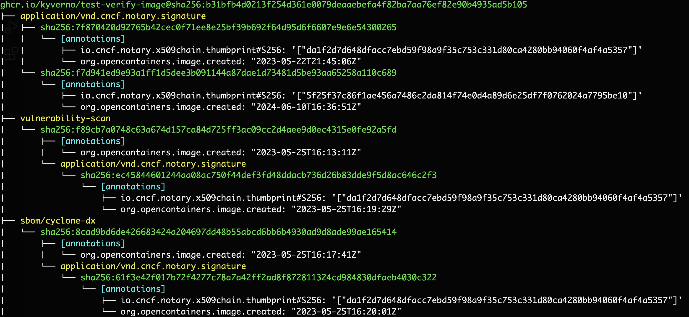

The ORAS Community is thrilled to announce the release of `ORAS v1.3.0-beta.3`! This milestone continues our vision to make managing OCI artifacts easier, faster, and more intuitive for users and developers.

This release includes new features, critical improvements, and bug fixes as we fine-tune ORAS for the upcoming stable release. Let’s dive into what’s new!

## ✨ What's New?

[OCI referrers](https://oras.land/docs/concepts/reftypes) is to associate additional artifacts with a container image without modifying the original image itself. Referrers are useful for software supply chain security, metadata enrichment, and artifact management.

`oras discover` provides structured output to show OCI referrers of a manifest in a registry or an OCI image layout. Previously, `oras discover` only shows direct referrers with limited metadata. Since this release, the output of `oras discover` has been enriched with showing all referrers recursively in all formatted outputs (tree, JSON, go-template) with annotations displayed by default. The subject manifest details is added to `oras discover` JSON output. It provides an informative output and ensures data consistency of different data formats in the output. 

The tree view has better readability with colored-code visual effect on console as the screenshot shows below.



In addition, `oras` introduces an experimental `--depth` flag for `oras discover`, allowing users to specify the maximum depth of referrers in the formatted output. It avoids throttling or performance issues when a subject image has a complex referrer graph. For example, users can list the direct referrers of a subject image by specifying `--depth 1` as the screenshot below.


## Breaking Changes and Deprecation You Should Know

- The global flag `--no-tty` flag has been removed, now available only for `oras` commands that need TTY behavior, improves consistency across commands.
- The property `manifests` has been renamed to `referrers` in the JSON output of `oras discover`
- The `table` output format is deprecated for `oras discover`

A sample output of `oras discover` in JSON format:

```console
oras discover ghcr.io/kyverno/test-verify-image:signed --format json
```

```json
{
  "reference": "ghcr.io/kyverno/test-verify-image@sha256:b31bfb4d0213f254d361e0079deaaebefa4f82ba7aa76ef82e90b4935ad5b105",
  "mediaType": "application/vnd.docker.distribution.manifest.v2+json",
  "digest": "sha256:b31bfb4d0213f254d361e0079deaaebefa4f82ba7aa76ef82e90b4935ad5b105",
  "size": 938,
  "referrers": [
    {
      "reference": "ghcr.io/kyverno/test-verify-image@sha256:7f870420d92765b42cec0f71ee8e25bf39b692f64d95d6f6607e9e6e54300265",
      "mediaType": "application/vnd.oci.image.manifest.v1+json",
      "digest": "sha256:7f870420d92765b42cec0f71ee8e25bf39b692f64d95d6f6607e9e6e54300265",
      "size": 738,
      "annotations": {
        "io.cncf.notary.x509chain.thumbprint#S256": "[\"da1f2d7d648dfacc7ebd59f98a9f35c753c331d80ca4280bb94060f4af4a5357\"]",
        "org.opencontainers.image.created": "2023-05-22T21:45:06Z"
      },
      "artifactType": "application/vnd.cncf.notary.signature"
    },
    {
      "reference": "ghcr.io/kyverno/test-verify-image@sha256:f89cb7a0748c63a674d157ca84d725ff3ac09cc2d4aee9d0ec4315e0fe92a5fd",
      "mediaType": "application/vnd.oci.image.manifest.v1+json",
      "digest": "sha256:f89cb7a0748c63a674d157ca84d725ff3ac09cc2d4aee9d0ec4315e0fe92a5fd",
      "size": 699,
      "annotations": {
        "org.opencontainers.image.created": "2023-05-25T16:13:11Z"
      },
      "artifactType": "vulnerability-scan",
      "referrers": [
        {
          "reference": "ghcr.io/kyverno/test-verify-image@sha256:ec45844601244aa08ac750f44def3fd48ddacb736d26b83dde9f5d8ac646c2f3",
          "mediaType": "application/vnd.oci.image.manifest.v1+json",
          "digest": "sha256:ec45844601244aa08ac750f44def3fd48ddacb736d26b83dde9f5d8ac646c2f3",
          "size": 728,
          "annotations": {
            "io.cncf.notary.x509chain.thumbprint#S256": "[\"da1f2d7d648dfacc7ebd59f98a9f35c753c331d80ca4280bb94060f4af4a5357\"]",
            "org.opencontainers.image.created": "2023-05-25T16:19:29Z"
          },
          "artifactType": "application/vnd.cncf.notary.signature"
        }
      ]
    },
    {
      "reference": "ghcr.io/kyverno/test-verify-image@sha256:8cad9bd6de426683424a204697dd48b55abcd6bb6b4930ad9d8ade99ae165414",
      "mediaType": "application/vnd.oci.image.manifest.v1+json",
      "digest": "sha256:8cad9bd6de426683424a204697dd48b55abcd6bb6b4930ad9d8ade99ae165414",
      "size": 695,
      "annotations": {
        "org.opencontainers.image.created": "2023-05-25T16:17:41Z"
      },
      "artifactType": "sbom/cyclone-dx",
      "referrers": [
        {
          "reference": "ghcr.io/kyverno/test-verify-image@sha256:61f3e42f017b72f4277c78a7a42ff2ad8f872811324cd984830dfaeb4030c322",
          "mediaType": "application/vnd.oci.image.manifest.v1+json",
          "digest": "sha256:61f3e42f017b72f4277c78a7a42ff2ad8f872811324cd984830dfaeb4030c322",
          "size": 728,
          "annotations": {
            "io.cncf.notary.x509chain.thumbprint#S256": "[\"da1f2d7d648dfacc7ebd59f98a9f35c753c331d80ca4280bb94060f4af4a5357\"]",
            "org.opencontainers.image.created": "2023-05-25T16:20:01Z"
          },
          "artifactType": "application/vnd.cncf.notary.signature"
        }
      ]
    },
    {
      "reference": "ghcr.io/kyverno/test-verify-image@sha256:aa886b475b431a37baa0e803765a9212f0accece0b82a131ebafd43ea78fa1f8",
      "mediaType": "application/vnd.oci.image.manifest.v1+json",
      "digest": "sha256:aa886b475b431a37baa0e803765a9212f0accece0b82a131ebafd43ea78fa1f8",
      "size": 681,
      "annotations": {
        "org.opencontainers.artifact.description": "CycloneDX JSON SBOM"
      },
      "artifactType": "application/vnd.cyclonedx+json",
      "referrers": [
        {
          "reference": "ghcr.io/kyverno/test-verify-image@sha256:00c5f96577878d79b545d424884886c37e270fac5996f17330d77a01a96801eb",
          "mediaType": "application/vnd.oci.image.manifest.v1+json",
          "digest": "sha256:00c5f96577878d79b545d424884886c37e270fac5996f17330d77a01a96801eb",
          "size": 728,
          "annotations": {
            "io.cncf.notary.x509chain.thumbprint#S256": "[\"da1f2d7d648dfacc7ebd59f98a9f35c753c331d80ca4280bb94060f4af4a5357\"]",
            "org.opencontainers.image.created": "2023-07-10T16:55:36Z"
          },
          "artifactType": "application/vnd.cncf.notary.signature"
        },
        {
          "reference": "ghcr.io/kyverno/test-verify-image@sha256:f3dc4687f5654ea8c2bc8da4e831d22a067298e8651fb59d55565dee58e94e2d",
          "mediaType": "application/vnd.oci.image.manifest.v1+json",
          "digest": "sha256:f3dc4687f5654ea8c2bc8da4e831d22a067298e8651fb59d55565dee58e94e2d",
          "size": 728,
          "annotations": {
            "io.cncf.notary.x509chain.thumbprint#S256": "[\"da1f2d7d648dfacc7ebd59f98a9f35c753c331d80ca4280bb94060f4af4a5357\"]",
            "org.opencontainers.image.created": "2023-07-10T16:56:36Z"
          },
          "artifactType": "application/vnd.cncf.notary.signature"
        }
      ]
    },
    ...
```

There are a few bug fixes and a deprecated feature in this release. For a concrete changelog, please see [ORAS CLI v1.3.0-beta.3 Release Notes](https://github.com/oras-project/oras/releases/tag/https://github.com/oras-project/oras/releases/tag/v1.3.0-beta.3).

## Join the ORAS community

You can follow this [installation guidance](https://oras.land/docs/1.3.0-beta/installation) to install ORAS v1.3.0-beta.3 and have a try.
Feedback is crucial at this stage. If you run into issues or have suggestions, please open an issue. [Join the Slack channel in CNCF](https://slack.cncf.io/) and find us at **oras** channel.
