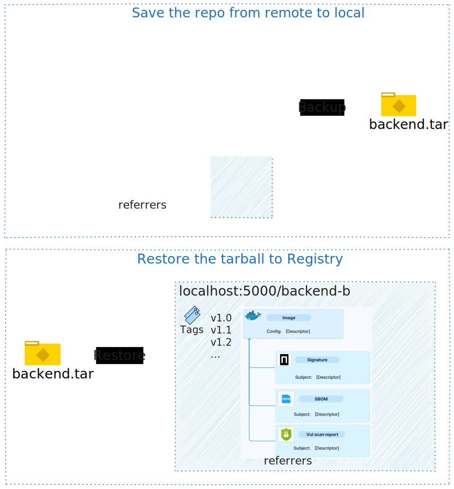

import Link from '@docusaurus/Link';

The ORAS community is thrilled to announce the ORAS CLI v1.3.0, a release packed with stability upgrades and pioneering capabilities. Beyond strengthening existing core functionality, this version introduces three major new features designed to elevate your artifact and registry management workflows:
<!-- truncate -->

1. **Portable backup & restore of repositories and artifacts**
2. **Multi-platform image and artifact management**
3. **Rich formatted output for scripting and pipelines**

Moreover, ORAS is now fully compliant with OCI [distribution-spec v1.1.1](https://github.com/opencontainers/distribution-spec/releases/tag/v1.1.1).

## Your Registry’s Safety Net: Portable Backup & Restore

With `oras backup` and `oras restore`, ORAS now lets you save your registry content into local directories or tarballs (OCI image layout format) as a snapshot and **restore to any registry**. All manifests and optionally any tags, referrers will be included within the backup.

Use cases include:

- **Air-Gapped Environments**: Organizations operating in isolated or high-security environments can use `oras backup` to export artifacts from a registry to local filesystem, and use `oras restore` to import them into an internal registry with restricted access.
- **Disaster Recovery and Audit Archival**: Take periodic snapshots of repositories and store them off-site. In case of accidental deletions, outages, and long-term storage to support regulatory audits, `oras restore` can be used to quickly recover full registry content.
- **Registry Migration**: When moving from one container registry provider to another, the pair of commands enables a full repository export, preserving tags, manifests, layers, and referrers.
- **Compliance and supply chain security guarantee**: Backup and restore the images along with their supply chain artifacts, such as SBOMs, signatures, vulnerability scanning reports.
- **Repository Duplication or Promotion**: Move artifacts from dev to staging to prod registries reliably using an intermediate backup file.

Check out the user guide <Link to="/docs/how_to_guides/backup-restore">Backup and Restore of OCI Artifacts, Images, and Repositories</Link> for details.

## Multi-platform Image and Artifact Management

Multi-platform images are commonly used in IoT and Edge computing, particularly heterogeneous deployments. In addition, OpenTofu or Terraform modules are packed as platform-specific artifacts and stored as multi-platform artifact in OCI registries. Thanks to our community partner OpenTofu, now multi-platform artifact management is introduced in v1.3.0.

With `oras manifest index create` and `oras manifest index update`, you can easily assemble, update, distribute, and annotate multi-architecture images and artifacts across local environments and registries. Check out the user guide <Link to="/docs/how_to_guides/multiarch">Create and Manage Multi-architecture Artifacts</Link> for details.

## Enable Scripting and Automation: Formatted Output 

In automation pipelines, the difference between human-readable and machine-usable output can be the difference between clarity and chaos.

With this release, ORAS enables users to use the `--format` flag to format metadata output into structured data (e.g. JSON) and optionally use the `--template` flag with the [Go template language](https://pkg.go.dev/text/template). This has been enabled for commands like `pull`, `push`, `attach`, `discover`, and `manifest fetch` with support for output formats including JSON, Go templates, trees, and tables. You can even run computations with Sprig template functions as well.

- Use `--format <DATA_FORMAT>` to transform the output of ORAS commands into different formats including prettified JSON, tree, table view, and Go template, i.e. `--format json|tree|table|go-template=GO_TEMPLATE`. 
- Use `--template GO_TEMPLATE` to compute and manipulate the output using Go templates based on the chosen data format. 

Formatted output transforms ORAS from a simple terminal user tool to a **DevOps-friendly, integrable** developer tool. Check out the user guide <Link to="/docs/how_to_guides/format_output">Formatted output</Link> for details.

## Stability & User Experience Polish

This release also includes a number of enhancements that provides a better overall user experience and stability.

* **Feature Stability Promotions**: `oras attach`, `oras pull --include-subject`, and more are now `Stable`. `oras resolve` from `Experimental` to `Preview`.
* **Discover UX**: `oras discover` now displays referrers recursively by default; The maximum recursion depth can be controlled via the --depth flag
* **Loong64 support**: More platform options including [loong64](https://wiki.debian.org/Ports/loong64) open for users.
* **Developer experience**: Enhanced clarity within error messages, debugging logs, and a number of documentation updates.

## Why This Release Matters

Whether you're looking to backup and restore entire registries, publish multi-architecture bundles, or integrate ORAS into CI/CD pipelines, v1.3.0 brings the tools and the end-to-end artifact management solutions you need.

* **Platform teams** gain robust disaster recovery and migration tooling.
* **DevOps engineers** get the multi-arch flexibility needed for heterogeneous infrastructure.
* **CI/CD and platform builders** enjoy structured data outputs for reliable, scriptable workflows.
* **Maintainers** ship safer, cleaner, and more future-proof artifact workflows.

There are a few bug fixes and a deprecated feature in this release. For a concrete changelog, please see the [ORAS v1.3.0 Release Notes](https://github.com/oras-project/oras/releases/tag/v1.3.0).

## Thanks to All Contributors

Thanks to our existing maintainers [@Wwwsylvia](https://github.com/Wwwsylvia), [@TerryHowe](https://github.com/TerryHowe), [@FeynmanZhou](https://github.com/FeynmanZhou), [@shizhMSFT](https://github.com/shizhMSFT), [@sabre1041](https://github.com/sabre1041), [@sajayantony](https://github.com/sajayantony), [@qweeah](https://github.com/qweeah) who contributed to ORAS v1.3.0 and new contributors 🎉 [@bcho](https://github.com/bcho), [@njucjc](https://github.com/njucjc), [@nmiyake](https://github.com/nmiyake), [@mauriciovasquezbernal](https://github.com/mauriciovasquezbernal), [@Horiodino](https://github.com/Horiodino), [@chrisguitarguy](https://github.com/chrisguitarguy), [@kysucix](https://github.com/kysucix), [@RohanMishra315](https://github.com/RohanMishra315), [@apparentlymart](https://github.com/apparentlymart), [@tanyabhatnagar](https://github.com/tanyabhatnagar), [@amazingfate](https://github.com/amazingfate) 🚀.

You can follow the [installation guidance](https://oras.land/docs/1.3.0/installation) to install ORAS v1.3.0 and try it out for yourself.
End user feedback is essential in any open source project. If you run into issues or have any suggestions, please open an issue. To engage with the community, feel free to [join the Slack channel in CNCF](https://slack.cncf.io/) and find us in the **oras** channel.