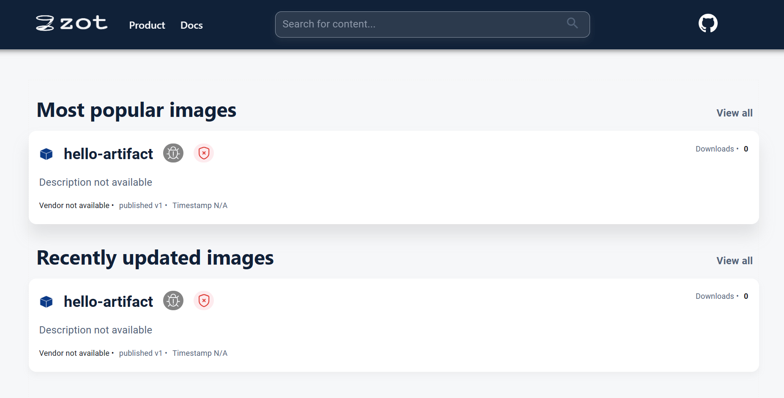

# Introduction to OCI registries using ORAS

Before we tackle how to distribute an OCI artifact to an OCI registry, let us first take a look at what we mean by distributing OCI artifacts, why we need it, and what OCI registries are. 

OCI registries are like a single location where container images and other artifacts are stored and made available to everyone. Distributing OCI artifacts refers to when artifacts are pushed to these registries. These artifacts can then be pulled (or retrieved) by someone else and used in their environments. These images often help with packaging and distributing software applications.

We will be using zot registry in this guide. Zot registry is an OCI-native container registry for distributing container images and OCI artifacts.

In order to follow the steps given, you would be required to install the ORAS CLI. You can follow the [installation guide](https://oras.land/docs/CLI/installation) to do so. 

### Phase 1: To Install Zot Registry 

We will be installing zot using docker. However, you can refer to their [installation guide](https://zotregistry.io/install-guides/install-guide-linux/) to find more ways to install the registry.

Prerequisites for this method:
* [Docker](https://www.docker.com/) 

```
docker run -p 5000:5000 ghcr.io/project-zot/zot-linux-amd64:latest
```

```
Unable to find image 'ghcr.io/project-zot/zot-linux-amd64:latest' locally
latest: Pulling from project-zot/zot-linux-amd64
a7ca0d9ba68f: Pull complete 
fe5ca62666f0: Pull complete 

<!-- truncated -->

after":"2h0m0s","goroutine":24,"caller":"zotregistry.io/zot/pkg/extensions/extension_search.go:160","time":"2023-05-20T10:50:45.892076536Z"}
{"level":"debug","component":"scheduler","worker":3,"goroutine":24,"caller":"zotregistry.io/zot/pkg/scheduler/scheduler.go:105","time":"2023-05-20T10:50:45.892089946Z","message":"scheduler: finished task"}
```


### Phase 2: Distribution of OCI Artifacts to Zot Registry Using Oras CLI

Please open a new terminal window for the next phase.

**Step 1: Create a sample file** 

```
echo "hello world" > artifact.txt
```

**Step 2: Pushing artifacts to the zot repository**

```
oras push --plain-http localhost:5000/hello-artifact:v1 \
        --artifact-type application/vnd.acme.rocket.config \
        artifact.txt:text/plain -d -v
```

```
Uploading a948904f2f0f artifact.txt
Uploaded  a948904f2f0f artifact.txt
Pushed [registry] localhost:5000/hello-artifact:v1
Digest: sha256:bcdd6799fed0fca0eaedfc1c642f3d1dd7b8e78b43986a89935d6fe217a09cee
```

After pushing the artifact, it can be seen in the zot user interface:




**Step 3: Pulling artifacts from the zot repository**

```
oras pull --plain-http localhost:5000/hello-artifact:v1 -d -v
```

```
DEBU[0000] > Request URL: "http://localhost:5000/v2/hello-artifact/manifests/v1" 
DEBU[0000] > Request method: "GET"                      
DEBU[0000] > Request headers: 

<!-- truncated -->

Downloaded  a948904f2f0f artifact.txt
Downloaded  bcdd6799fed0 application/vnd.oci.image.manifest.v1+json
Pulled [registry] localhost:5000/hello-artifact:v1
Digest: sha256:bcdd6799fed0fca0eaedfc1c642f3d1dd7b8e78b43986a89935d6fe217a09cee
```

**Step 4: To attach files to an existing artifact**

First, let's create another sample file to attach to the previously uploaded artifact,

```
echo "hello world" > hi.txt
```

You can use the command below to attach `hi.txt` to the artifact we pushed above:

```
oras attach --plain-http --artifact-type doc/example localhost:5000/hello-artifact:v1 hi.txt
```

```
Exists    a948904f2f0f hi.txt
Attached to [registry] localhost:5000/hello-artifact@sha256:327db68f73d0ed53d528d927a6703c00739d7c1076e50762c3f6641b51b76fdc
Digest: sha256:bcdd6799fed0fca0eaedfc1c642f3d1dd7b8e78b43986a89935d6fe217a09cee
```

**Step 5: To check the referrers of the manifest in our zot registry**

```
oras discover --plain-http localhost:5000/hello-artifact:v1
```

```
Discovered 1 artifact referencing v1
Digest: sha256:327db68f73d0ed53d528d927a6703c00739d7c1076e50762c3f6641b51b76fdc

Artifact Type   Digest
doc/example     sha256:bcdd6799fed0fca0eaedfc1c642f3d1dd7b8e78b43986a89935d6fe217a09cee
```

**Note:** The  `--plain-http` flag allows connections to the registry without SSL check. As this set up is insecure,
it can be used for testing purposes. However, you can set up TLS using [these steps](https://github.com/project-zot/zot/blob/main/examples/README.md#network).

### Conclusion

You can now successfully push OCI artifacts to your zot registry! 

As OCI registries are used to securely store and share container images, they greatly help with collaboration and code sharing. They enable teams to acquire and use images through a standardized artifact interface. This is why it is considered to play a crucial role in maintaining consistency among teams.