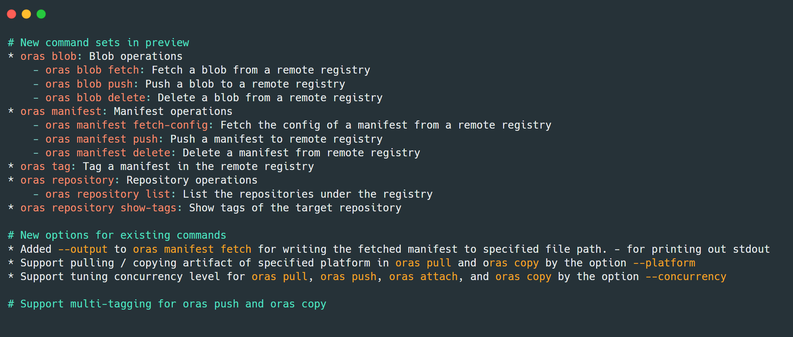

# ORAS 0.15: A fully Functional OCI Registry Client

_Author: [Feynman Zhou](https://twitter.com/FeynmanZhou), [Yi Zha](https://github.com/yizha1)_

The [OCI Registry As Storage (ORAS)](https://oras.land/) project maintainers announced two releases of v0.15 for the ORAS CLI recently. ORAS [v0.15.0](https://github.com/oras-project/oras/releases/tag/v0.15.0) introduces four new top-level commands and new options to manage tags and repos in registries and provides capabilities to alter the OCI content for advanced use cases. Three weeks later, [ORAS 0.15.1](https://github.com/oras-project/oras/releases/tag/v0.15.1) also released with a few known bug fixes. Since the release of v0.15, ORAS CLI has evolved into a fully functional OCI registry client.

## What's new in ORAS 0.15



As ORAS has been adopted by more and more OCI implementors and registry vendors, we have seen increased community requirements in providing fine-grained capabilities to alter the content of OCI supply chain artifacts. ORAS 0.15 now supports operate the blob and manifest of an artifact in the registry. Please see the [Release Notes](https://github.com/oras-project/oras/releases/tag/v0.15.0) for details.

This blog post will demonstrate how to use ORAS CLI v0.15 to convert a Docker image stored in Docker Hub into an OCI image， then push it to the Distribution registry.

## Run a local Distribution registry

Run a local instance of the CNCF Distribution Registry, with ORAS Artifacts support:

```
docker run -d -p 5000:5000 ghcr.io/oras-project/registry:v1.0.0-rc.2
```

## Fetch and view the manifest of a sample Docker image

```
$ oras manifest fetch docker.io/library/hello-world@sha256:f54a58bc1aac5ea1a25d796ae155dc228b3f0e11d046ae276b39c4bf2f13d8c4

{
   "schemaVersion": 2,
   "mediaType": "application/vnd.docker.distribution.manifest.v2+json",
   "config": {
      "mediaType": "application/vnd.docker.container.image.v1+json",
      "size": 1469,
      "digest": "sha256:feb5d9fea6a5e9606aa995e879d862b825965ba48de054caab5ef356dc6b3412"
   },
   "layers": [
      {
         "mediaType": "application/vnd.docker.image.rootfs.diff.tar.gzip",
         "size": 2479,
         "digest": "sha256:2db29710123e3e53a794f2694094b9b4338aa9ee5c40b930cb8063a1be392c54"
      }
   ]
}
```

## Fetch and push a blob

Fetch a config blob to a local file from a sample Docker image:

```
oras blob fetch docker.io/library/hello-world@sha256:feb5d9fea6a5e9606aa995e879d862b825965ba48de054caab5ef356dc6b3412 --output config-blob.json
```

Then push this blob file to a new repo in the Distribution registry:

```
oras blob push localhost:5000/oras-distribution/hello-world:latest@sha256:92c7f9c92844bbbb5d0a101b22f7c2a7949e40f8ea90c8b3bc396879d95e899a demo-blob.json
```

Similarly, fetch the layer blob and push it to the Distribution registry:

```
oras blob fetch docker.io/library/hello-world@sha256:2db29710123e3e53a794f2694094b9b4338aa9ee5c40b930cb8063a1be392c54 --output layer-blob.json
```

```
oras blob push localhost:5000/oras-sample/hello-world layer-blob.json
```

## Fetch and push a manifest

Similar to blob operations above, fetch a manifest from a Docker image stored in Docker Hub and export it to a JSON file:

```
oras manifest fetch docker.io/library/hello-world@sha256:f54a58bc1aac5ea1a25d796ae155dc228b3f0e11d046ae276b39c4bf2f13d8c4 --output hello-manifest.json
```

Modify the manifest file `hello-manifest.json` from Docker to OCI type in each `mediatype` field of config and layer:

```
{
   "schemaVersion": 2,
   "mediaType": "application/vnd.oci.image.manifest.v1+json",
   "config": {
      "mediaType": "application/vnd.oci.image.config.v1+json",
      "size": 1469,
      "digest": "sha256:feb5d9fea6a5e9606aa995e879d862b825965ba48de054caab5ef356dc6b3412"
   },
   "layers": [
      {
         "mediaType": "application/vnd.oci.image.layer.v1.tar+gzip",
         "size": 2479,
         "digest": "sha256:2db29710123e3e53a794f2694094b9b4338aa9ee5c40b930cb8063a1be392c54"
      }
   ]
}
```

Push the modified manifest file to the repository in the Distribution registry. It will also create a new repository automatically:

```
oras manifest push localhost:5000/oras-repo/hello-world:latest hello-manifest.json
```

## Validate the new image 

View the manifest of this Docker image from the Distribution registry, you will find all `mediatype` are changed to OCI type: 

```
$ oras manifest fetch localhost:5000/oras-repo/hello-world:latest
{
   "schemaVersion": 2,
   "mediaType": "application/vnd.oci.image.manifest.v1+json",
   "config": {
      "mediaType": "application/vnd.oci.image.config.v1+json",
      "size": 1469,
      "digest": "sha256:feb5d9fea6a5e9606aa995e879d862b825965ba48de054caab5ef356dc6b3412"
   },
   "layers": [
      {
         "mediaType": "application/vnd.oci.image.layer.v1.tar+gzip",
         "size": 2479,
         "digest": "sha256:2db29710123e3e53a794f2694094b9b4338aa9ee5c40b930cb8063a1be392c54"
      }
   ]
}
```

Run and validate the new OCI image:

```
$ docker run localhost:5000/oras-repo/hello-world:latest

Hello from Docker!
This message shows that your installation appears to be working correctly.

To generate this message, Docker took the following steps:
 1. The Docker client contacted the Docker daemon.
 2. The Docker daemon pulled the "hello-world" image from the Docker Hub.
    (amd64)
 3. The Docker daemon created a new container from that image which runs the
    executable that produces the output you are currently reading.
 4. The Docker daemon streamed that output to the Docker client, which sent it
    to your terminal.

To try something more ambitious, you can run an Ubuntu container with:
 $ docker run -it ubuntu bash

Share images, automate workflows, and more with a free Docker ID:
 https://hub.docker.com/

For more examples and ideas, visit:
 https://docs.docker.com/get-started/

```

It turns out the conversion works.

## Try multi-tagging and view the tags 

Tag the manifest with 'latest' to 'v1.0.0', 'v2.0.0':

```
$ oras tag localhost:5000/oras-repo/hello-world:latest v1.0.0 v2.0.0
```

View the newly created tags in the sample repo:

```
$ oras repo show-tags localhost:5000/oras-repo/hello-world
latest
v1.0.0
v2.0.0
```

Congratulations! You have experienced all new top-level commands in ORAS CLI 0.15. 

## What's next for ORAS

Recently, the ORAS maintainers submitted the proposal via [pr-934](https://github.com/opencontainers/image-spec/pull/934) and [pr-335](https://github.com/opencontainers/distribution-spec/pull/335) to OCI which provides a solution that adds new capabilities to OCI registries while maintaining the ability to function on existing registries. This proposal originates from the [ORAS artifact spec](https://github.com/oras-project/artifacts-spec) and has been accepted by the OCI group. OCI group also cut new release in distribution-spec and image-spec to support Reference Types. 

In ORAS CLI 0.16 and ORAS-go v2.0.0-rc.4, support OCI artifact spec will be the most significant plan and is targeted to be released at the end of October. You can find the migration proposal from this [doc](https://hackmd.io/zLnCh8WRQDG-3S_jXR626g?view). See also the [ORAS Roadmap](https://github.com/oras-project/community/blob/main/Roadmap.md) for more detailed future plans.

## Join the ORAS community
 
The ORAS Project was accepted in June 2021 as a Cloud Native Computing Foundation (CNCF) Sandbox project. It is important that we hear from the community as we advance the artifact-spec capability; if you maintain or are implementing a container registry, we are particularly interested in your feedback. Working together, we can improve supply chain artifact security in the cloud native ecosystem. 

- [Follow the ORAS Twitter](https://twitter.com/intent/follow?screen_name=orasproject)
- [Join the Slack channel in CNCF](https://slack.cncf.io/) and find us at **oras** channel