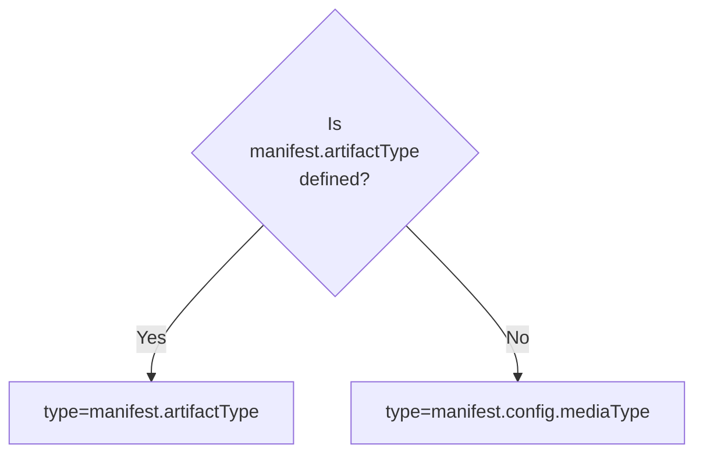
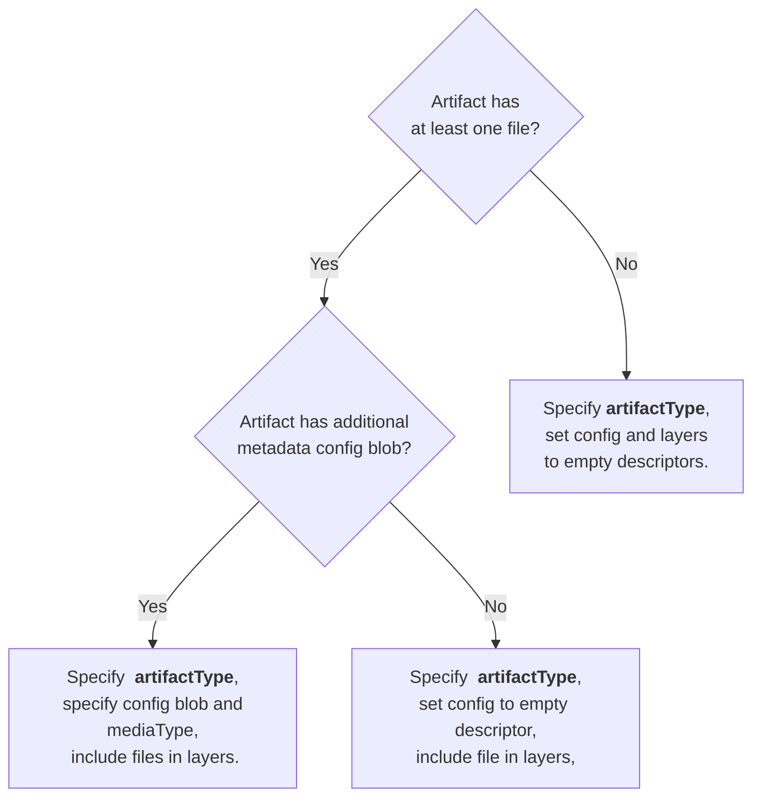

# Understanding OCI artifacts

The Open Container Initiative (OCI) organization has played
a crucial role in defining the industry-standard specifications for container
formats, runtime, and artifacts.
OCI artifacts encompass an extensive variety of content types, from signatures,
Software Bill of Materials (SBOMs), Helm charts, container images, to Open Policy Agent (OPA)
bundles and more, thereby lending incredible flexibility to how containerized
applications are packaged, delivered, and updated.

This article will delve into OCI artifacts created using a manifest defined as a part of
the OCI image specification.

## The Anatomy of an OCI artifact

The structure of an OCI Artifact includes an Image Manifest or an Image Index
that points to other OCI artifacts. These artifacts can be stored and accessed from
[content addressable storage][cas] like a registry, or an on-disk storage like
an [OCI-Layout][oci-layout] directory.

The OCI artifact can be referenced using a *tag*
or a *digest*. The digest is a hash of the OCI artifact manifest or index and
should be assumed to be immutable where as the tag may be mutable.

A *tag* resolves to a data structure called the [descriptor][descriptor] which
contains the digest of the manifest or index.


### The Significance of Annotations

Annotations in OCI artifacts offer a means of adding metadata to various
components, including the Image Manifest, Image Index and Image Layers.
These annotations hold key-value pairs that represent either the metadata
of the OCI artifact or blobs, such as the creation time, or data of the artifact itself.

```json
{
  ...
  "annotations": {
    "oci.opencontainers.image.created": "2023-01-02T03:04:05Z",
    "com.example.information": "useful-info"
  }
}
```

### Determining the artifact type

For OCI artifacts the **type** of the artifact may be determined from the `artifactType` property
in the image manifest or index. This property was introduced in v1.1 of the [image specification][image-properties].

In cases when the `artifactType` property is not defined, the `config.mediaType` property may be used to determine
the type of the artifact as shown in the diagram below.



For artifact authors, the sections below should help deciding on the blob and
config mediaTypes.

## Dissecting the Manifest

The structure of the artifact depends on the purpose of the artifact and content.
The manifest is a JSON document that contains the metadata for the artifact.
Artifacts may have files that are stored as blobs or metadata that is stored in the manifest
as annotations. The manifest may also contain references to other artifacts.

### Artifacts with blobs

Let's delve into an OCI artifact that uses an [Image Manifest][image-manifest].
Below is an example where artifact type is `application/vnd.example+type`. The artifact
also has blobs that are referenced in the manifest in the `layers` property. It is
important to note that the `config` property is required in the manifest and
in this case the config is an empty blob as per the [empty descriptor guidance][empty-descriptor].

```json
 {
  "schemaVersion": 2,
  "mediaType": "application/vnd.oci.image.manifest.v1+json",
  "artifactType": "application/vnd.example+type",
  "config": {
    "mediaType": "application/vnd.oci.empty.v1+json",
    "digest": "sha256:44136fa355b3678a1146ad16f7e8649e94fb4fc21fe77e8310c060f61caaff8a",
    "size": 2
  },
  "layers": [
    {
      "mediaType": "application/vnd.oci.image.layer.v1.tar",
      "digest": "sha256:d2a84f4b8b650937ec8f73cd8be2c74add5a911ba64df27458ed8229da804a26",
      "size": 12,
      "annotations": {
        "org.opencontainers.image.title": "hello.txt"
      }
    }
  ],
  "annotations": {
    "org.opencontainers.image.created": "2023-08-03T00:21:51Z"
  }
}
```

### Artifacts with config

Clients have been using the `config.mediaType` property  to declare the artifact type.
For OCI artifacts that have a valid config blob the config blob may use its own
mediaType and the `artifactType` property can be set to indicate the type of artifact.

```json
   {
     "schemaVersion": 2,
     "mediaType": "application/vnd.oci.image.manifest.v1+json",
     "artifactType": "application/vnd.example+type",
     "config": {
       "mediaType": "application/vnd.example.config.v1+json",
       "digest": "sha256:5891b5b522d5df086d0ff0b110fbd9d21bb4fc7163af34d08286a2e846f6be03",
       "size": 123
     },
     "layers": [
       {
         "mediaType": "application/vnd.example.data.v1.tar+gzip",
         "digest": "sha256:e258d248fda94c63753607f7c4494ee0fcbe92f1a76bfdac795c9d84101eb317",
         "size": 1234
       }
     ]
   }
```

#### Prior Art

Before version 1.1 of the [image specification][image-spec], the `config.mediaType`
was used to indicate the type of the artifact.
For example the artifact type below for the helm chart is `application/vnd.cncf.helm.config.v1+json`
as the manifest does not have the `artifactType` property.

```json
{
  "schemaVersion": 2,
  "mediaType": "application/vnd.oci.image.manifest.v1+json",
  "config": {
    "mediaType": "application/vnd.cncf.helm.config.v1+json",
    "digest": "sha256:34bf03806938a59ee7dc3e2c33e314d0eaef573313ff9dcc677113502d568523",
    "size": 145
  },
  "layers": [
    {
      "mediaType": "application/vnd.cncf.helm.chart.content.v1.tar+gzip",
      "digest": "sha256:4d80464e9d8e9f3ba92e6ead6d3b5afd0532cb0a81e980599a0bced99fdc6e01",
      "size": 3763
    }
  ]
}
```

### Annotations only artifacts

Artifacts may store metadata in the manifest as annotations and need not have a config or blobs.
For these the `artifactType` property is used to declare the type of the artifact.
The config property is required in the manifest and for maximum compatibility
an empty layer is also created as per the  [empty descriptors guidance][empty-descriptor].

```json
{
  "schemaVersion": 2,
  "mediaType": "application/vnd.oci.image.manifest.v1+json",
  "artifactType": "application/vnd.example+type",
  "config": {
    "mediaType": "application/vnd.oci.empty.v1+json",
    "digest": "sha256:44136fa355b3678a1146ad16f7e8649e94fb4fc21fe77e8310c060f61caaff8a",
    "size": 2
  },
  "layers": [
    {
      "mediaType": "application/vnd.oci.empty.v1+json",
      "digest": "sha256:44136fa355b3678a1146ad16f7e8649e94fb4fc21fe77e8310c060f61caaff8a",
      "size": 2
    }
  ],
  "annotations": {
    "oci.opencontainers.image.created": "2023-01-02T03:04:05Z",
    "com.example.info": "useful-info"
  }
}
```

### Artifact authoring decision tree

Putting it all together with the types of artifacts listed above and
[Artifact Guidance in the image specification][artifact-guidelines], the decision tree
below should help determine what fields to set when creating an artifact.



### Harnessing Image Indexes

One of the key advantages of OCI artifacts is their ability to utilize [Image Indexes][image-index],
allowing the bundling of various OCI artifacts.

The Image Index is a higher-level construct in the OCI Image Specification that can point to
multiple Image Manifests, each suitable for a different platform or architecture or filtered by annotation.
It helps to group related artifacts together, providing a single entry-point for accessing any specific
artifact depending on the required condition.

## Best Practices and Limitations

While working with OCI artifacts, keep in mind that client tools and registries
are in the process of implementing v1.1 version of the OCI image and distribution specifications.

- When clients or registries support the `artifactType` property, the `config.mediaType`
can be set to _application/vnd.oci.empty.v1+json_ if the artifact doesn't have a config.
blob as per the [empty descriptor guidance][empty-descriptor].
- As a rule of thumb, keep the manifest size manageable by avoiding excessive annotations
and leveraging blobs for larger data chunks.

## The Road Ahead

The evolution of OCI artifacts is a journey in progress. While the current specification
does not permit an empty config blob, it's plausible that future updates might
make config and blobs optional eliminating the need for the empty blob.

By understanding OCI artifacts and their role in representing
container images, developers and DevOps teams can ensure the smooth deployment
and execution of containerized applications. The open and standardized nature of
OCI artifacts promotes interoperability among different clouds and platforms,
enabling seamless container orchestration and scaling across cloud and
on-premises infrastructures.

To learn more about the OCI Image Specification and Image Manifests, you can
refer to the official [OCI Image Specification GitHub repository](
https://github.com/opencontainers/image-spec) and explore the detailed
specifications.

[cas]: https://en.wikipedia.org/wiki/Content-addressable_storage
[oci-layout]: https://github.com/opencontainers/image-spec/blob/v1.1.0-rc4/image-layout.md
[descriptor]: https://github.com/opencontainers/image-spec/blob/v1.1.0-rc4/descriptor.md
[image-spec]: https://github.com/opencontainers/image-spec/blob/v1.1.0-rc4/spec.md
[image-manifest]: https://github.com/opencontainers/image-spec/blob/v1.1.0-rc4/manifest.md#image-manifest
[image-properties]: https://github.com/opencontainers/image-spec/blob/v1.1.0-rc4/manifest.md#image-manifest-property-descriptions
[empty-descriptor]: https://github.com/opencontainers/image-spec/blob/v1.1.0-rc4/manifest.md#guidance-for-an-empty-descriptor
[image-index]: https://github.com/opencontainers/image-spec/blob/v1.1.0-rc4/image-index.md#image-index-property-descriptions
[artifact-guidelines]: https://github.com/opencontainers/image-spec/blob/v1.1.0-rc4/manifest.md#guidelines-for-artifact-usage
