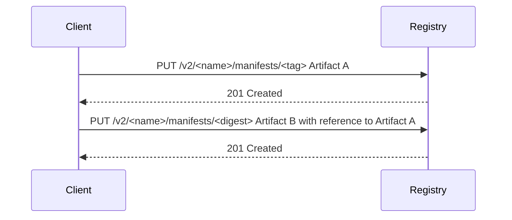
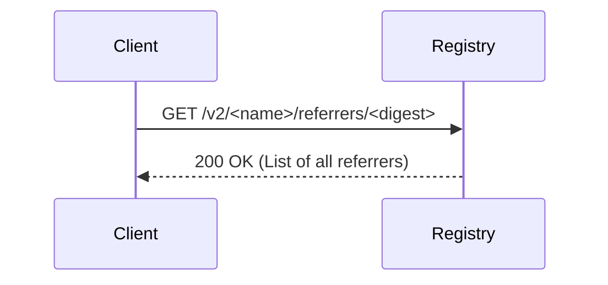
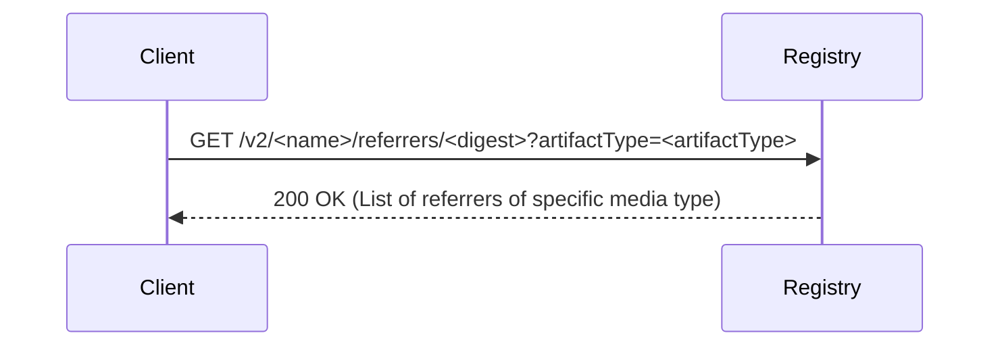
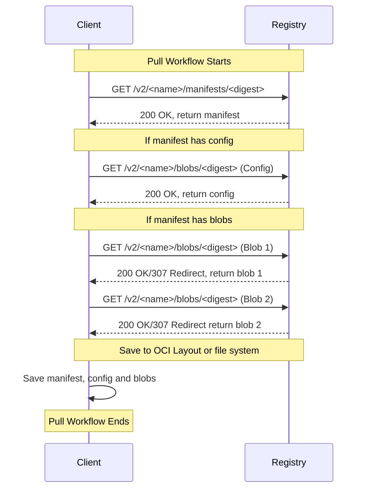

# Attaching and listing reference types

The OCI distribution specification allows us to "link" [OCI artifacts](artifact.mdx)
through the use of the concept of reference types.
Artifacts can be tied to one another by defining one as a subject of another.
This is crucial for maintaining dependencies between different artifacts and
enabling the movement of artifacts and their dependencies between environments.

## Implementing Reference Types in OCI artifacts

The concept of linking or relating OCI artifacts is achieved using the concept
of reference types, where one artifact can be set as a subject to another.
In this context, "subject" refers to the target of a reference.

### The Art of Associating Artifacts

Consider a typical cloud-native environment with countless OCI artifacts.
Often, it's imperative to manage relationships between them—say, an OCI artifact's
signatures, or metadata about an artifact. This is where reference types come into the picture.

A reference type enables an OCI artifact to refer to another, creating a defined
link or association between them. This association can be for various purposes,
such as versioning, supply chain artifacts (signatures, SBOM, etc.), and dependencies.


## Creating a Reference Artifact

OCI Artifacts may be stored in a content-addressable storage system or OCI Layout directory.
For the purpose of this guide, we'll use the OCI Distribution Specification to
create and list reference types.

The creation of a reference artifact is a two-step process:

- **Step One**: PUT an artifact, say Artifact A, using the PUT Manifest and
blob upload APIs if the artifact has blob content. The prerequisite for a reference
type is that the subject artifact must be known so that it may be added to the subject.

- **Step Two**: Put another artifact, say Artifact B, which refers to Artifact A.
In this case, Artifact A is the 'subject' of Artifact B.

This is done using the [push workflow][push-workflow] in the distribution specification.



In this sequence, the client first uploads Artifact A to the registry.
Next, the client uploads Artifact B to the same registry, but this time with a
reference to Artifact A by specifying the digest of Artifact A as the subject.
The association is now established in the registry.

:::tip NOTE
The specification does allow  pushing the reference artifact **without** requiring
the presense of the the `subject` in the target registry or OCI-Layout.
:::

The following example shows the manifest of Artifact B with a reference to Artifact A
in the `subject` field.

```json
 {
  "schemaVersion": 2,
  "mediaType": "application/vnd.oci.image.manifest.v1+json",
  "artifactType" : "application/example",
  "config": {
    "mediaType": "application/vnd.oci.empty.v1+json",
    "digest": "sha256:44136fa355b3678a1146ad16f7e8649e94fb4fc21fe77e8310c060f61caaff8a",
    "size": 2
  },
  "layers": [
    {
      "mediaType": "application/vnd.oci.image.layer.v1.tar",
      "digest": "sha256:d2a84f4b8b650937ec8f73cd8be2c74add5a911ba64df27458ed8229da804a26",
      "size": 12,
      "annotations": {
        "org.opencontainers.image.title": "attach/hello.txt"
      }
    }
  ],
  "subject": {
    "mediaType": "application/vnd.oci.image.manifest.v1+json",
    "digest": "sha256:5e140a61e16155b30356685a6801e5250339bfb11370e70573d28d4ff2dc89cf",
    "size": 477
  },
  "annotations": {
    "org.opencontainers.image.created": "2023-08-05T06:58:38Z"
  }
}
```

## Listing Referrers

Once an artifact has one or more referring artifacts, it's often necessary to
list these referrers for various purposes such as tracking dependencies, updates
or obtaining metadata of the artifact.
The OCI [Distribution Specification][listing-referrers] defines an API endpoint
(`/v2/<name>/referrers/<digest>`) for this purpose.

If the registry does not support listing referrers, then the [referrers tag schema][tag-schema]
may be used to obtain a client created non-dynamic index of referrers.

For the purpose of this guide we will use the [referrers API][listing-referrers].

### Listing all referrers

In this sequence, the client requests a list of all referrers to a specific artifact
from the registry, which then responds with the list.
The list may be paginated if the number of referrers is large.



### Listing referrers with a specific artifact type

In this sequence, the client requests a list of referrers to a specific artifact
of a certain media type from the registry, which then responds with the filtered list.
The response will include the `OCI-Filters-Applied: artifactType` header to indicate
that the response is filtered by the `artifactType` query parameter.

The artifact type is determied by the same rules as per
[OCI artifacts guidlines](artifact.mdx#determining-the-artifact-type).



The request below lists shows an example for listing referrers of a specific media type.

```json
GET /v2/hello-world/referrers/sha256:5e140a6..?artifactType=application%2Fexample HTTP/1.1

// response
Content-Type: application/vnd.oci.image.index.v1+json
Oci-Filters-Applied: artifactType

{
  "schemaVersion": 2,
  "mediaType": "application/vnd.oci.image.index.v1+json",
  "manifests": [
    {
      "mediaType": "application/vnd.oci.image.manifest.v1+json",
      "digest": "sha256:a10d2cf503458e48996a3e3030c75fb5f5cd967e21a38ca69ce6c1e1dee5fd27",
      "size": 677,
      "annotations": {
        "org.opencontainers.image.created": "2023-08-05T07:08:43Z"
      },
      "artifactType": "application/example"
    }
  ]
}
```

## Fetching the reference artifact

Once the referrers have been queried, the client may fetch the reference artifact
using the digest that is returned in the list of referrers.
The client may then use the digest to fetch the artifact contents using the
[pull workflow][pull-workflow] as described in the distribution specification.



## The Power of Associations

The introduction of Reference Types (Associations) opens a world of possibilities in
managing and linking of OCI Artifacts while also empowering the following scenarios:

- Discovery and distribution of artifacts like SBOMs or signatures for supply chain.
- Movement of a graph of OCI content across environments.
- Content management of a graph of artifacts by archiving, deleting or moving them
together.

To further explore this concept, dive deeper into the
[OCI Distribution Specification][distribution-spec] and the [OCI Image Specification][image-spec].
These comprehensive guides will provide more insights into the use of
reference types and other details of managing OCI Artifacts.

[listing-referrers]: https://github.com/opencontainers/distribution-spec/blob/v1.1.0-rc3/spec.md#listing-referrers
[pull-workflow]: https://github.com/opencontainers/distribution-spec/blob/v1.1.0-rc3/spec.md#pull
[push-workflow]: https://github.com/opencontainers/distribution-spec/blob/v1.1.0-rc3/spec.md#push
[tag-schema]: https://github.com/opencontainers/distribution-spec/blob/v1.1.0-rc3/spec.md#referrers-tag-schema
[distribution-spec]: https://github.com/opencontainers/distribution-spec/blob/v1.1.0-rc3/spec.md
[image-spec]: https://github.com/opencontainers/image-spec/blob/v1.1.0-rc4/spec.md
