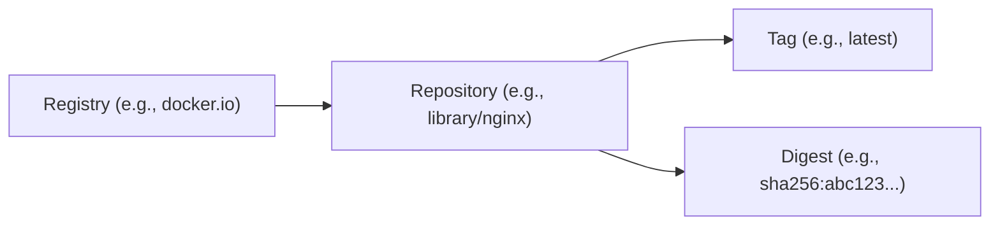

# Understanding References in the Open Container Initiative (OCI) Standard

One of the core concepts when dealing with container images or
[OCI artifacts](artifact.mdx) is the notion of a reference.
Let's dive deep into this concept, especially within the context of
the Open Container Initiative (OCI) standard.

## Image or Artifact References: Breaking Down the Components

An image reference is essentially the 'address' or 'identifier' you use to
pull or manage a specific container image or OCI artifact.

There are primarily two contexts in which you'll encounter references:

1. Interacting with a registry to pull or push images.
2. Interacting with a local OCI Layout store to manage local content.

Let's take a look at the components of an reference in these 2 scenarios.

### What a Reference Means in the Registry

When you pull or push an artifact or image from a registry, you need to specify the reference.
This reference is a combination of three parts:

1. **Registry**: This is akin to the home or the server where your images or artifacts are stored.
Think of it as the overarching domain. Examples include Docker Hub (docker.io),
GitHub Container Registry (ghcr.io), or your own private registry.
2. **Repository**: This is a segment of the reference, after the registry where a particular 
application or service's images are stored.
The repository doesn't necessarily follow a hierarchy within the registry, meaning `a/b/c`
and `a/b/c/d` are both valid and distinct repositories, with no implied hierarchy between them.
3. **Tag or Digest**: This is the last part indicating the version of the image or artifact 
you want to pull or push.

#### References by Tag

- **Tag**: Tags are user-friendly references to specific image or artifact versions.
Common tags include `latest`, `v1.0`,
or any other description that makes sense for versioning or identiying and resolve to a digest.
These are typically human readable and easy to remember.


:::caution
Tags are mutable. This means that the same tag can point to different digests over time.
:::

#### References by Digest

Reference by a digest is a unique, immutable identifier for a specific image or artifact.
Typically represented as a SHA256 hash of the image's content, the digest guarantees
you're pulling or referencing the exact version of the image and artifact and is **immutable**.


:::note
The digest is the most precise way to reference an image.
However, it's not very user-friendly.
This is why tags are more commonly used.
A tag always resolves to a digest.
:::

#### References by Tag and Digest

Putting it all together, a reference includes a registry, a repository, and a tag or a digest in the context
of a **registry**.



### What a Reference Means in OCI Layout

In the OCI Layout specification, a reference can be a tag or a digest.
The OCI Layout defines how image data should be stored on disk.
This layout facilitates image distribution, making it easier for tools to push and pull images.
The references in the OCI Layout help in uniquely identifying an image and its components.

The layout directory contains a file called `index.json` that contains the references to the image's components.
The below `index.json` file contains a reference to a manifest file and it can be accessed as `v1` or the digest
`sha256:921f70dafac450afd63cc4210b2086cb4290ef7d51249eb79c4777e731b87746`.

```json
{
  "schemaVersion": 2,
  "manifests": [
    {
      "mediaType": "application/vnd.oci.image.manifest.v1+json",
      "digest": "sha256:921f70dafac450afd63cc4210b2086cb4290ef7d51249eb79c4777e731b87746",
      "size": 555,
      "annotations": {
        "org.opencontainers.image.created": "2023-08-19T00:05:47Z",
        "org.opencontainers.image.ref.name": "v1"
      },
      "artifactType": "application/example"
    }
  ]
}
```

For a detailed understanding, refer to the [OCI Layout Specification][oci-layout-index].

### How OCI Uses Image References

In the OCI standard, when a client (like docker) needs to pull an image,
it uses the combined image reference to precisely identify and retrieve the
right image or artifact from a registry.

However, it's worth noting that certain implementations, such as docker, provide
defaults or shortcuts. For instance, if you were to use docker to pull an image
using the reference `nginx`, docker would automatically resolve this to
`docker.io/library/nginx:latest`. Here, `docker.io` is the default registry and
`library/nginx` is the repository with a 'library' prefix for official images and `latest` is the
default tag. 

### Conclusion

Understanding the components of an `reference` is vital when working with containers or OCI artifacts.
These references ensure that clients are addressing the desired version of the image or artifact.
Having a solid grasp of foundational concepts like image references becomes even more essential
as you start to use image and artifacts across your cloud native environments.

[oci-layout-index]: https://github.com/opencontainers/image-spec/blob/v1.1.0-rc4/image-layout.md#indexjson-file